# Job Config Chain

[](LICENSE)
[](https://github.com/sponsors/Retro-kharkov1)

A Jenkins plugin for **job-scoped configuration management** with **base-chain composition**,
**secrets binding**, and **build-identity pinning** for safe rollback. It keeps a nested,
structured config-token store (a shared **common** layer plus per-Job overrides) structurally in
sync with `#{Dotted.Path}#` placeholder tokens in a target application config file (e.g.
`appsettings.json`, `application.yml`). It validates drift between the store and the file before a
deploy, and substitutes real values into the file at deploy time — without an external database
and without a git-backed store; everything is persisted natively under `$JENKINS_HOME`.

## ☕ Support this project

If this plugin saves you time, consider supporting its development:

[](https://github.com/sponsors/Retro-kharkov1)

- **Buy Me a Coffee:** [buymeacoffee.com/retro.kharkov](https://buymeacoffee.com/retro.kharkov)
- **USDT (crypto donation):** <!-- TODO: add wallet address once created -->

## Install / build

Build with the bundled Maven Wrapper — no separate script or CI platform required:

```
./mvnw clean verify      # Linux/macOS
mvnw.cmd clean verify    # Windows
```

The wrapper computes the plugin's version from git history via the
[GitVersion](https://gitversion.net/) CLI (`dotnet-gitversion`, config in `GitVersion.yml`) before
delegating to Maven, and passes it as `-Drevision=<computed SemVer>` (Maven's
[CI Friendly Versions](https://maven.apache.org/maven-ci-friendly.html) mechanism — see `pom.xml`).
If `dotnet-gitversion` is not installed, the build still succeeds and falls back to the default
`revision` in `pom.xml` (`0.0.0-SNAPSHOT`).

### Zero-host-tooling option: Docker build

If you don't want to install Java, Maven, or the GitVersion CLI on your machine at all — only
[Docker](https://www.docker.com/) is required — use:

```
./docker-build.sh      # Linux/macOS/Git Bash/WSL
docker-build.cmd       # Windows cmd.exe
```

This runs the exact same two logical steps as `mvnw`/`mvnw.cmd`, just inside containers instead of
on the host: [`gittools/gitversion`](https://gitversion.net/docs/usage/docker) computes the SemVer,
then the official `maven` image (`eclipse-temurin-21`) runs `mvn -Drevision=<computed SemVer> clean
verify`. `target/job-config-chain.hpi` lands on the **host** filesystem at the same path either
way, since the repo directory is bind-mounted (not copied) into both containers.

### Installing the built `.hpi`

Manual upload: Manage Jenkins → Plugins → Advanced settings → Deploy Plugin → select
`target/job-config-chain.hpi`.

A self-hosted private Update Center (search-and-install like an official plugin) is also supported
— see the update-center scripts under `distribution/` if you want that flow instead of manual
upload.

### Installing a published release

Cutting a GitHub Release on this repository publishes the build two ways
(`.github/workflows/publish-github-packages.yaml`). Pick the one that matches what you're doing:

**Installing the plugin into a running Jenkins — use the Release asset, no credentials needed.**
Every [GitHub Release](https://github.com/Retro-kharkov1/job-config-chain/releases) has the built
`.hpi` attached as a downloadable asset. Download it, then Manage Jenkins → Plugins → Advanced
settings → Deploy Plugin → select the downloaded file (same flow as the local build above, just
skipping the build step). No GitHub account or token is required — the asset is a plain,
anonymously-downloadable file.

**Consuming this plugin as a Maven dependency — use GitHub Packages, credentials required.**
The `.hpi`, `.jar`, and `pom` are also published to this repository's GitHub Packages Maven
registry at `https://maven.pkg.github.com/Retro-kharkov1/job-config-chain`. GitHub's Maven
registry requires authentication to download from it even for a public package — there is no
anonymous-read mode. Add both a repository entry and matching server credentials:

```xml
<!-- pom.xml or a profile -->
<repositories>
  <repository>
    <id>github</id>
    <url>https://maven.pkg.github.com/Retro-kharkov1/job-config-chain</url>
  </repository>
</repositories>
```

```xml
<!-- ~/.m2/settings.xml -->
<servers>
  <server>
    <id>github</id>
    <username>YOUR_GITHUB_USERNAME</username>
    <password>YOUR_GITHUB_PERSONAL_ACCESS_TOKEN</password> <!-- needs read:packages scope -->
  </server>
</servers>
```

This is an interim/parallel distribution channel, independent of the official Jenkins Update
Center path described in `HOSTING.md`.

## Getting started

A from-scratch walkthrough for a brand-new user, install to first successful build.

**1. Install the plugin.** Follow [Install / build](#install--build) above, then upload
`target/job-config-chain.hpi` via Manage Jenkins → Plugins → Advanced settings → Deploy
Plugin.

**2. Create your first Config Key (Common Config Set).** On the global `/configTemplates` page,
click "New Config Set," give it a name (e.g. `sample-app`), and submit the creation form:

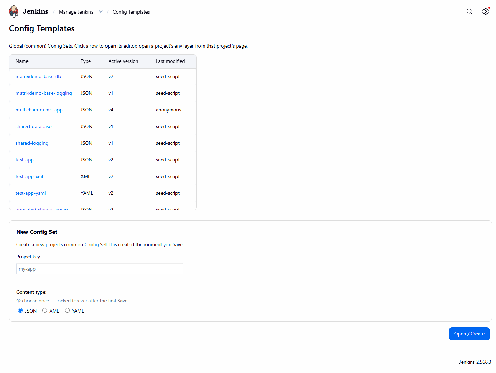
*The "New Config Set" creation form, pre-submit.*

**3. See its empty version history.** A brand-new Config Set has no saved versions yet — this is
a normal, valid starting state, not an error:

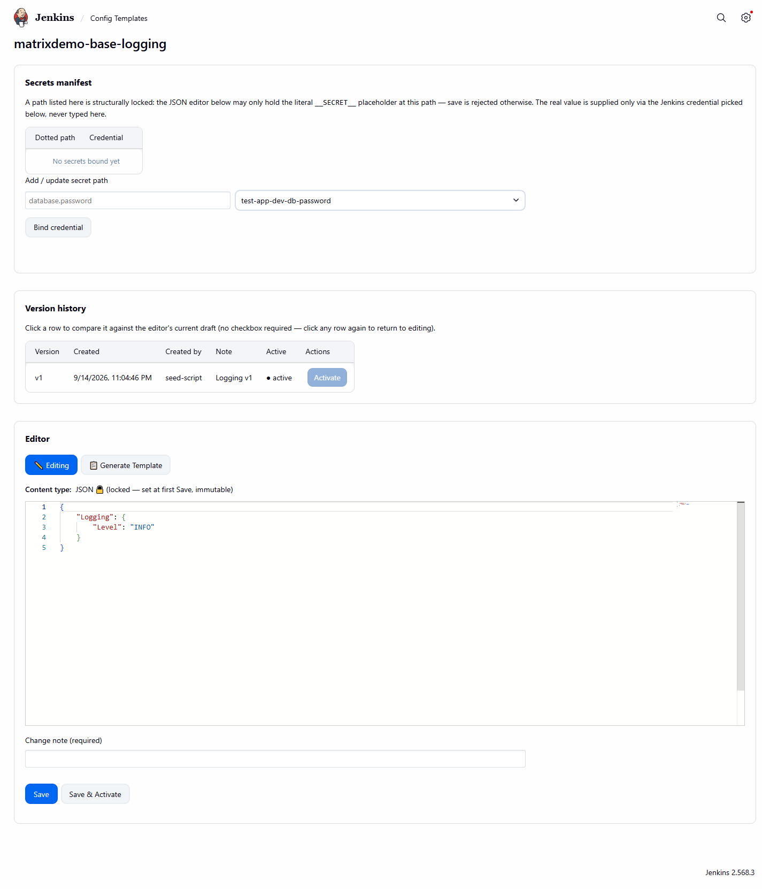
*A near-empty version history table right after creation, before the first save.*

**4. Write and save your first version.** Open the Config Set's editor, enter its nested baseline
content (e.g. `{"Database":{"Host":"db.internal"}}`), and save with a change note. Optionally
activate it immediately:

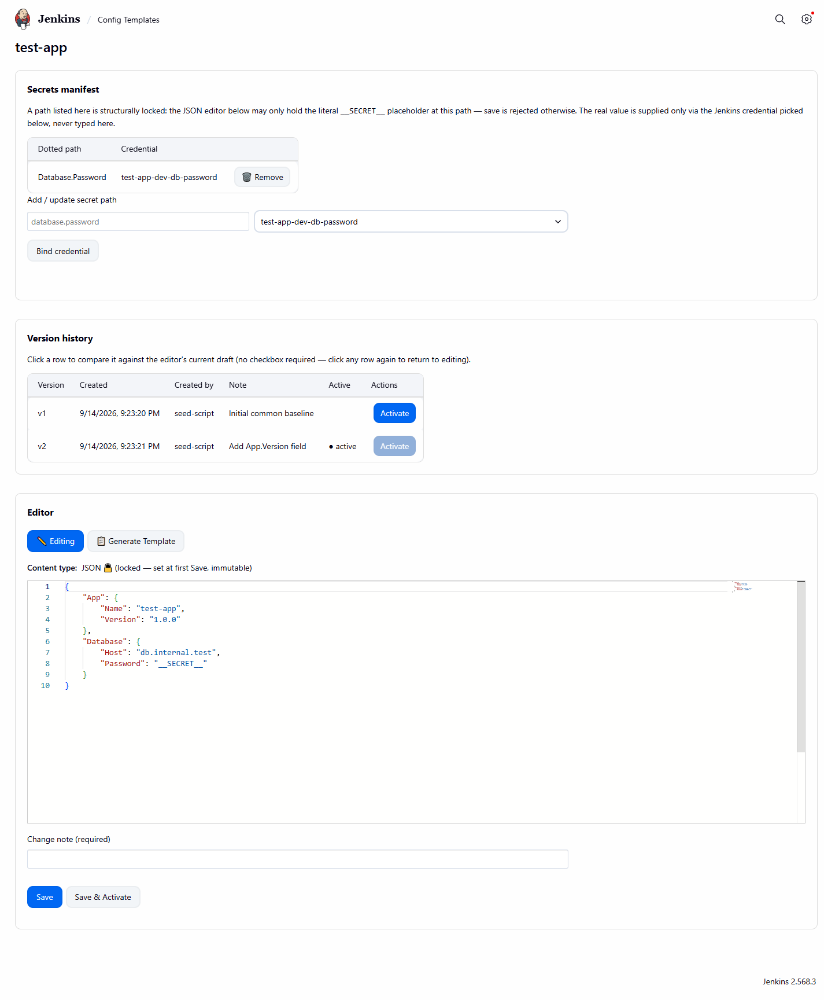
*Editing a Common Config Set's nested content, version history, and secrets manifest.*

A successful save is confirmed with a native Jenkins toast:

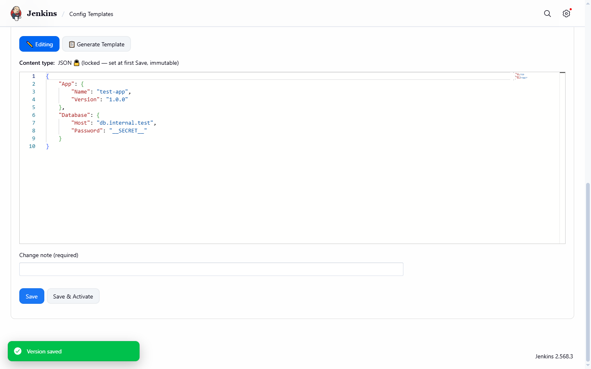
*A native Jenkins toast confirming a successful save.*

**5. Add a secret binding.** Mark any leaf that holds a credential (e.g. a connection password) as
secret and bind it to a Jenkins credential ID — never a real value:

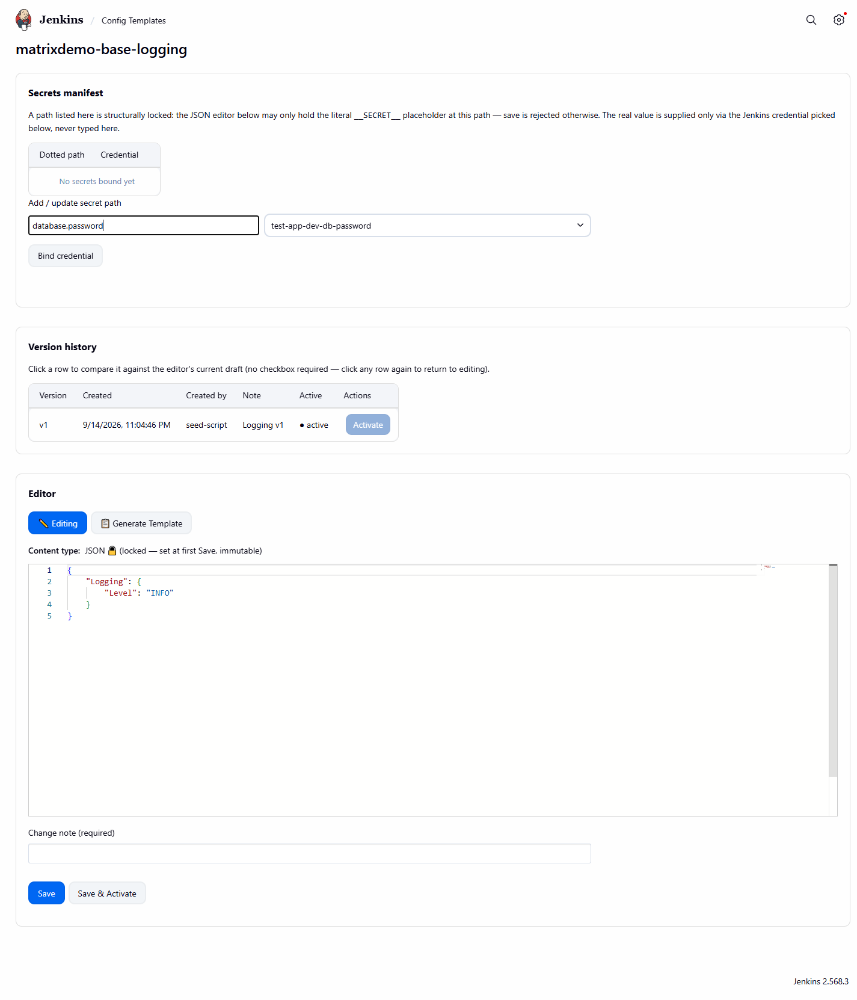
*The add-secret form: a dotted-path field plus a Jenkins credential picker.*

**6. Attach the target Job's own Config Templates page.** On the Job that will consume this
config, open `/job/<name>/configTemplates`:

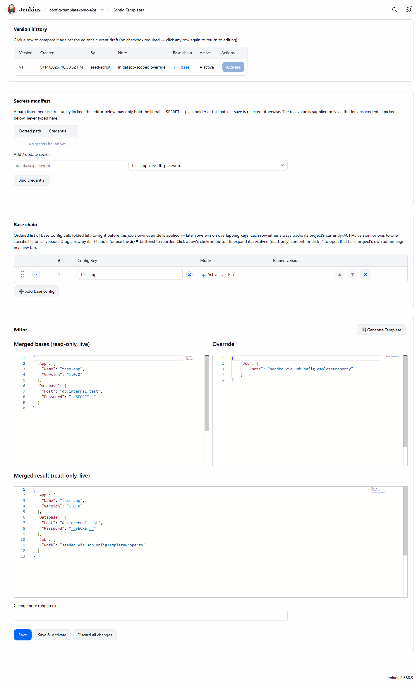
*A Job's own `/configTemplates` page — its base chain plus its own override content, side by
side.*

**7. Add a base-chain entry.** Reference the Config Key created in step 2 (`ACTIVE`, or pinned to
a specific version) via the base-chain "add row" picker:

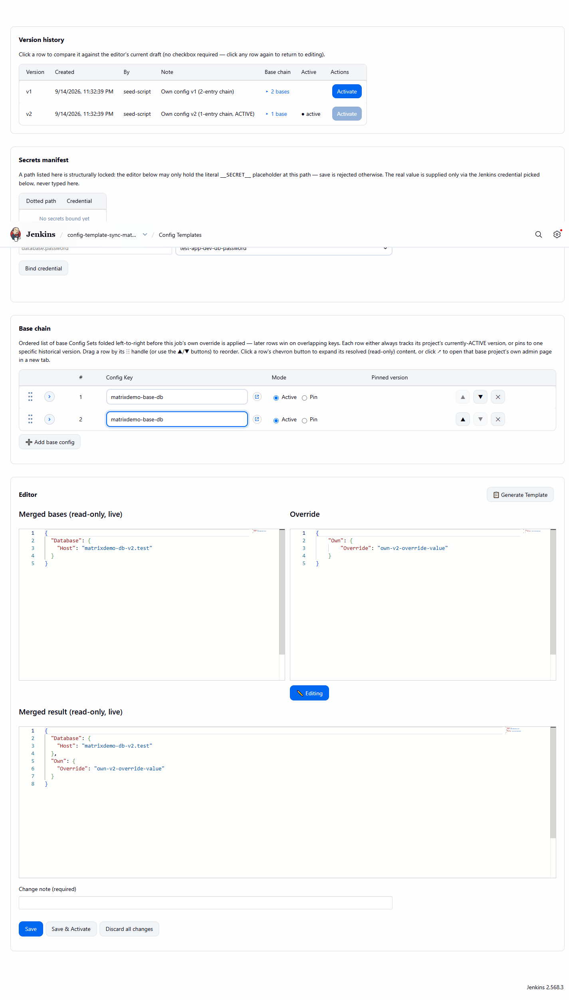
*The base-chain "add row" Config Key picker, expanded.*

Optionally add this Job's own override content (e.g. `{"Own":{"Override":"own-value"}}`), then
save a version for the Job.

**8. Write a minimal Jenkinsfile** calling the pipeline steps:

```groovy
pipeline {
  agent any
  stages {
    stage('Prepare config') {
      steps {
        configTemplateValidate(file: 'app.json')
        configTemplateSubstitute(file: 'app.json')
      }
    }
  }
}
```

`configTemplateValidate` fails the build if `app.json` references a `#{Path}#` token with no
matching key in the effective (merged) configuration. `configTemplateSubstitute` then resolves
secrets from their bound Jenkins credentials and substitutes every token in place.

**9. Trigger a build and read the console output.** The build console names exactly which
resolution-matrix row the call hit, in the current `#{...}#`-wrapped message format:

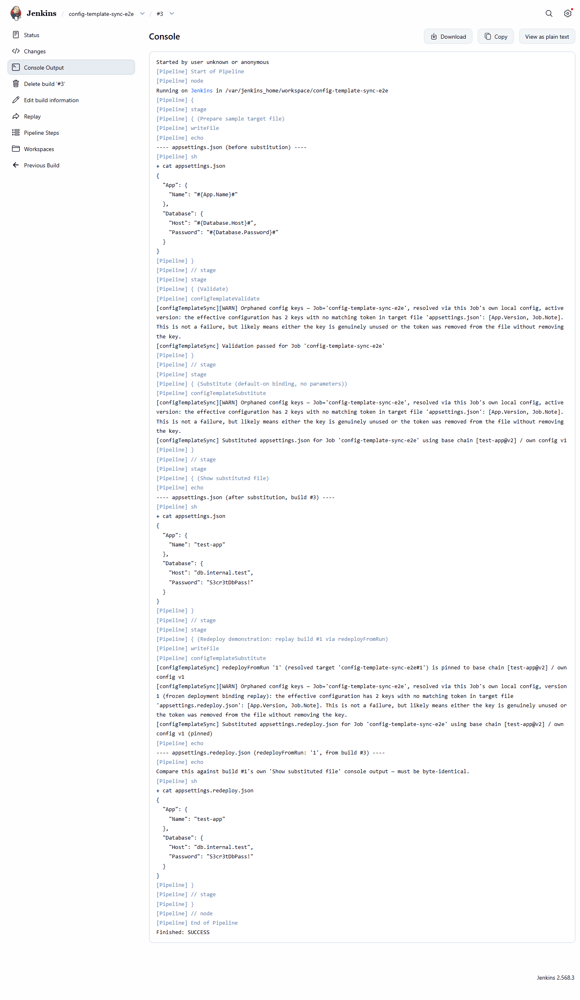
*A build console log naming exactly which resolution-matrix row a pipeline call hit.*

That's a complete round trip — Config Key created, versioned, secret-bound, attached to a Job,
and successfully resolved by a real pipeline build.

## Pipeline step reference

### Parameters

`configTemplateValidate` / `configTemplateSubstitute` take:

| Parameter | Type | Meaning |
|---|---|---|
| `file` | String, **always required** | Path to the target config file to validate/substitute. |
| `useBase` | boolean, default `false` | When `true`, resolves the base chain only (own override ignored), or redirects to a named global Config Set when `configKey` is also given. |
| `configKey` | String, optional | Only valid together with `useBase: true`. Names a global COMMON Config Set to resolve directly, independent of the calling Job's own base chain. |
| `version` | int, optional | Pins a specific version instead of the currently ACTIVE one. Meaning depends on the other parameters — see the matrix below. |
| `redeployFromRun` | int or `<jobFullName>#<buildNumber>`, optional (`configTemplateSubstitute` only) | Replays a different Run's frozen Deployment Binding byte-identically, for rollback. |

There is no `environment` parameter — every call resolves, by construction, against the **calling
Job's own attached local config**, unless `useBase: true` + `configKey` explicitly redirects to a
named global Config Set.

> **Planned, not yet available:** the token delimiter shown throughout this document (`#{...}#`)
> is being made configurable per Config Key/Job (five built-in presets — `{{...}}`, `${...}`,
> `$(...)`, `%...%`, `#{...}#` — plus a custom prefix/suffix pair), with `#{...}#` staying the
> permanent zero-config default. This is a finalized spec, but **no code implementing it has been
> written yet** — every call, template, and message in this document today uses `#{...}#`
> unconditionally, with no way to change it.

### Resolution matrix

| `useBase` | `configKey` | `version` | Resolves to |
|---|---|---|---|
| `false` | — | — | Job's own local config, ACTIVE version, full effective content (own override + its folded base chain) |
| `false` | — | `N` | Job's own local config, version `N`, full effective content of that version |
| `false` | given | any | **fail-loud** — `configKey` only valid together with `useBase: true` |
| `true` | — | — | Job's own local config, ACTIVE version's folded base chain only (own override content ignored) |
| `true` | — | `N` | Job's own local config, version `N`'s own recorded base chain folded (that version's own override ignored) — unambiguous regardless of chain length |
| `true` | `X` | — | Global COMMON Config Set named `X`, its ACTIVE version — direct global lookup by name, NOT required to be present in the Job's own base chain |
| `true` | `X` | `N` | Global COMMON Config Set named `X`, pinned to version `N` |

### Isolation rule

A call can **never** reach another Job's own attached local config, by any parameter, under any
composition — full stop. The only things any call can ever reach are (a) the calling Job's own
local config, and (b) any global COMMON-role Config Set, named directly via `configKey` or
referenced in the Job's own base chain. There is no parameter that names a target Job, so this
isolation is structural, not a runtime check that could be bypassed.

### Jenkinsfile Map-parameter convention

A single Map built once and passed as the step's sole argument — `file` lives in the same map, not
appended separately:

```groovy
def cfg = [
    file: 'app.json',
    useBase: true,
    version: 5
    // configKey: 'shared-database',   // optional, only meaningful together with useBase: true
]
configTemplateValidate(cfg)
configTemplateSubstitute(cfg)
```

`setupConfigTemplate(file:, useBase:, configKey:, version:, redeployFromRun:)` is a build-scoped
convenience alternative: call it once, and any later zero-argument (or partial) call to
`configTemplateValidate()`/`configTemplateSubstitute()` in the same build reads whichever parameter
it wasn't itself given from the stored state. Explicit call-site parameters always override stored
setup state, per parameter. `setupConfigTemplate` is rejected inside a `parallel {}` block (its
build-scoped state would be ambiguous across concurrently-running branches); the two other steps
remain fully safe inside `parallel {}` when called with their own full explicit parameters.

### Fail-loud paths

- **`configKey` without `useBase: true`:**
  `[configTemplateSync] 'configKey' ('<value>') is only valid together with useBase: true — remove
  'configKey', or add 'useBase: true' to this call.`
- **`configKey` names a Config Set that doesn't exist:**
  `[configTemplateSync] No global COMMON Config Set found for configKey '<value>'.`
- **`file` missing from both the call site and any prior `setupConfigTemplate` call:** an
  `AbortException` naming `file` as the missing required parameter.
- **Missing-key drift (fatal, `configTemplateValidate`):** `Missing config keys — target file
  '<file>' (Job='<jobFullName>', resolved via <resolution mode>) references <N> token(s) with no
  matching key in the effective configuration: <list>. Check for a typo in the token's dotted
  path, or add this key to the resolved source described above.`
- **Orphaned-key drift (non-fatal, warning only):** `Orphaned config keys — Job='<jobFullName>',
  resolved via <resolution mode>: the effective configuration has <N> key(s) with no matching token
  in target file '<file>': <list>. This is not a failure, but likely means either the key is
  genuinely unused or the token was removed from the file without removing the key.`
- **Unresolved token remains after substitution:** the substitute step fails loudly rather than
  leaving `#{...}#`-shaped text in the output file.
- **Missing secret credential:** the build fails loudly naming the credential ID; it never
  substitutes a placeholder or empty value.

### Build-pinning and reproducibility

On every successful real substitution, the plugin creates or updates a **Deployment Binding**,
keyed purely by the current Run's own identity (`run.getExternalizableId()`) — default-on, no
opt-in flag. The binding freezes the exact resolved base-chain version numbers and own-config
version used.

- **Same-Run replay:** a second (or later) real-substitution call within the *same* Run reuses that
  Run's already-written binding instead of re-resolving `ACTIVE`/`PINNED` references live —
  guaranteeing every call within one build sees the identical effective configuration, even if a
  base Config Set's active version changes mid-build.
- **`redeployFromRun` cross-Run replay:** `configTemplateSubstitute(..., redeployFromRun:
  <build-number-or-jobFullName#buildNumber>)` looks up the Deployment Binding of the **target**
  Run (not the current one) and substitutes using its frozen chain — byte-identical to the target
  Run's original output, even if a referenced base Config Set's active version has since changed.
  The current Run also gets its own fresh binding written, so a future rollback can chain forward
  and target it too. If no binding exists for the resolved target, the step falls back to the
  current Job's own live base chain and says so loudly in the build log, naming the unresolved
  value — it never aborts nor silently substitutes the target's current live-active config.
- An explicit `version` parameter always suppresses binding lookup/write for that call — a
  deliberate one-off version override must never corrupt a Run's own natural binding history.

## Use cases

Every scenario below is a `when you need to X, do Y` walkthrough, grouped by theme. Each keeps its
`UF-N` id for traceability back to the use-case catalog and the plugin's own javadoc citations.
Screenshots are woven in at the point they illustrate the described behavior; several screenshots
already shown in [Getting started](#getting-started) are referenced again here where they're the
best illustration of that use case too.

### Authoring config: adding keys and getting the paste-ready template

#### UF-1 — Add a new config key

When you need to introduce a new setting (a feature flag, connection string, or per-Job override),
open the relevant Config Set (common or Job-scoped), add the key at the correct nested path, mark
it secret/non-secret (supplying a Jenkins credential ID if secret — never a real value), and save
a new version with a mandatory change note.

*Example:* open a Common Config Set → add `Feature.NewFlag: true` → save with change note "Add new
feature flag" → optionally activate immediately. Screenshot: [Common Config Set
editor](docs/screenshots/02-common-config-editor.png).

*Outcome:* a new, versioned snapshot exists; "Generate template" returns the same key rendered as
`#{Feature.NewFlag}#`, ready to paste into the app's config file.

#### UF-2 — Get the exact template to paste into your app's config file

When an application developer needs the tokens for their config file, request "Generate template"
for the relevant scope and paste the returned block verbatim into the target file.

*Example:* "Generate template" on a Common Config Set returns
`{"Database":{"Host":"#{Database.Host}#"}}`, pasted directly into `appsettings.Production.json`.

*Outcome:* zero hand-typed tokens — the token text is copy-pasted from the system's own output,
eliminating typo drift.

### Deploying: validate then substitute

#### UF-3 — Validate config drift before deploying

When your deploy pipeline needs to catch a broken/renamed token before it reaches a live deploy,
call `configTemplateValidate(file: 'app.json')` before any real substitution.

*Example:*
```groovy
configTemplateValidate(file: 'app.json')
```
If `app.json` contains `#{doesNotExist}#` with no matching key, the build fails naming
`doesNotExist`. If the effective configuration has an unused key, the build succeeds with a
`[WARN]` naming it — see [UF-23](#uf-23--missing-key-drift-fails-the-build-naming-the-token-orphaned-key-drift-warns-without-failing)
for the exact wording of both outcomes and a real failure console.

*Outcome:* the pipeline proceeds only when no token is left unresolvable.

#### UF-4 — Substitute real values at deploy time

Once validation passes, call `configTemplateSubstitute(file: 'app.json')`.

*Example:*
```groovy
configTemplateSubstitute(file: 'app.json')
```
*Outcome:* every `#{Path}#` token in `app.json` is replaced with its real value (secrets resolved
from their bound Jenkins credential, never from a stored placeholder), a Deployment Binding is
written recording exactly which versions were used, and the pipeline proceeds to deploy the
substituted file.

### Rollback: reverting config and replaying old builds

#### UF-5 — Roll back a bad config change

When a just-activated config version turns out to be broken, open the Config Set's version
history and click "Activate" on a prior version.

*Example:* on a Common Config Set's edit page, select version 3 in the history table → Activate.
The active pointer flips from version 4 back to version 3; no content is duplicated.

*Outcome:* the system confirms which version is now active and shows a diff versus what was active
a moment ago. Activation never triggers a live deploy by itself — the operator must separately
trigger a new deploy for the rollback to reach the running server.

#### UF-6 — Roll back a server to an older build with its matching old config

When you redeploy (or reactivate) an older build/version identifier through the normal deploy
pipeline, pass `redeployFromRun` so the matching old config comes back automatically.

*Example:*
```groovy
configTemplateSubstitute(file: 'app.json', redeployFromRun: 42)
```
*Outcome:* if a Deployment Binding exists for build #42, substitution uses that binding's pinned
versions — not whatever is currently "active." If no binding exists, the system falls back to
currently-active and says so explicitly in the log.

### Resolution-matrix rows — controlling exactly what a call resolves to

All seven rows below are demonstrated live by the `config-template-sync-matrix-demo` job — see
[screenshot 16](docs/screenshots/16-matrix-demo-row-list.png) for its full build history list,
covering every row in one place.

#### UF-7 — Default call resolves the calling Job's own active config (matrix row 1)

When you just want the ordinary, no-frills resolution every normal deploy uses, call with only
`file` — no `useBase`, `configKey`, or `version`.

*Example:* a Job's own config has one base-chain entry (`matrixdemo-base-db`@ACTIVE) plus its own
override `{"Own":{"Override":"own-v2-override-value"}}`:
```groovy
configTemplateSubstitute(file: 'app.json')
```
*Outcome:* both `Own.Override` (from the Job's own content) and `Database.Host` (from the folded
base) land in the substituted file. Demonstrated live by `config-template-sync-matrix-demo`, build
#1 ("ROW1-DEFAULT"). Screenshot: [job-scoped editor](docs/screenshots/03-job-scoped-editor.png).

#### UF-8 — Version-pinned own-config call (matrix row 2)

When you need to verify or replay a specific historical own-config version, supply `version: N`
with `useBase` omitted/`false` and `configKey` omitted.

*Example:*
```groovy
configTemplateSubstitute(file: 'app.json', version: 1)
```
*Outcome:* resolves version 1's own content and its own recorded base chain exactly as saved,
regardless of whichever version is active today. Demonstrated live by
`config-template-sync-matrix-demo`, build #2 ("ROW2-VERSION-PIN").

#### UF-9 — `useBase`-only call resolves the Job's own active chain, override ignored (matrix row 4)

When you want only the shared/base configuration, deliberately excluding this Job's own overrides,
call with `useBase: true` and both `configKey`/`version` omitted.

*Example:*
```groovy
configTemplateSubstitute(file: 'app.json', useBase: true)
```
*Outcome:* resolves `Database.Host` from the base chain but leaves `Own.Override` absent — visibly
different from UF-7's output for the identical Job/version. Demonstrated live by
`config-template-sync-matrix-demo`, build #3 ("ROW4-USEBASE").

#### UF-10 — `useBase` + `version`, no `configKey`: pinned own-version's own chain, any length (matrix row 5)

When you need the base chain exactly as it was recorded on one specific past own-config version,
independent of what's active now, supply `useBase: true` and `version: N` together, `configKey`
omitted.

*Example:*
```groovy
configTemplateSubstitute(file: 'app.json', useBase: true, version: 1)
```
*Outcome:* folds version 1's own 2-entry chain (`matrixdemo-base-db`, `matrixdemo-base-logging`),
producing both `Database.Host` and `Logging.Level` — proving a multi-entry chain pins cleanly.
Demonstrated live by `config-template-sync-matrix-demo`, build #4
("ROW5-USEBASE-VERSION-PIN"). Screenshot: [expanded base-chain
row](docs/screenshots/04-base-chain-expanded-row.png).

#### UF-11 — `useBase` + `configKey`: direct global lookup by name, ACTIVE (matrix row 6)

When you need a specific shared/global configuration directly, whether or not it's part of this
Job's own base chain, supply `useBase: true` and `configKey: 'X'`, `version` omitted.

*Example:* `unrelated-shared-config` is never referenced by the calling Job's own chain at all:
```groovy
configTemplateSubstitute(file: 'app.json', useBase: true, configKey: 'unrelated-shared-config')
```
*Outcome:* still resolves it directly, returning its ACTIVE content — chain membership is not
required. Demonstrated live by `config-template-sync-matrix-demo`, build #5
("ROW6-USEBASE-CONFIGKEY").

#### UF-12 — `useBase` + `configKey` + `version`: direct global lookup, pinned (matrix row 7)

When you need a reproducible, specific historical version of a named global configuration, supply
`useBase: true`, `configKey: 'X'`, and `version: N` together.

*Example:*
```groovy
configTemplateSubstitute(file: 'app.json', useBase: true, configKey: 'unrelated-shared-config', version: 1)
```
*Outcome:* resolves `Shared.Value` from version 1 — visibly different from UF-11's ACTIVE (v2)
output for the identical `configKey`. Demonstrated live by `config-template-sync-matrix-demo`,
build #6 ("ROW7-USEBASE-CONFIGKEY-VERSION-PIN").

### Fail-loud paths and isolation

#### UF-13 — `configKey` supplied without `useBase: true` fails loud (matrix row 3)

If you call with `configKey` set but `useBase` omitted or `false`, the build aborts immediately
rather than silently falling through to some other resolution.

*Example:*
```groovy
configTemplateSubstitute(file: 'app.json', configKey: 'unrelated-shared-config')
```
*Outcome:* aborts with `[configTemplateSync] 'configKey' ('unrelated-shared-config') is only valid
together with useBase: true — remove 'configKey', or add 'useBase: true' to this call.`
Demonstrated live by `config-template-sync-matrix-demo`, build #7 ("ROW3-FAILLOUD").

#### UF-14 — `configKey` names a Config Set that doesn't exist as a global COMMON Config Set

If `configKey` was mistyped or never created as a COMMON Config Set, the call fails loud instead
of silently resolving nothing.

*Trigger:* `useBase: true, configKey: 'X'` where no global COMMON Config Set named `X` exists.

*Example:*
```groovy
configTemplateSubstitute(file: 'app.json', useBase: true, configKey: 'typo-name')
```
*Outcome:* aborts with `[configTemplateSync] No global COMMON Config Set found for configKey
'typo-name'.`

#### UF-15 — A call can never reach another Job's own attached config

No parameter combination, on any of the three pipeline steps, can be coerced into naming a target
Job other than the one actually running the step.

*Example:* there is no parameter on any of the three pipeline steps that names a target Job.

*Outcome:* isolation is structural, not a bypassable runtime check — no code path accepts another
Job's identifier. Global COMMON Config Sets remain reachable by any Job via `useBase`+`configKey`
regardless of chain membership (see UF-11) — that is not an isolation violation, since a global
Config Set belongs to no single Job.

#### UF-16 — Job has no attached config at all: valid, silent no-op (state 1)

A brand-new Job with nothing configured yet is a valid resolution target, not an error state.

*Trigger:* a resolution-matrix row targeting the Job's own config (rows 1/2/4/5) is called against
a Job with no config property at all, or zero saved versions.

*Example:*
```groovy
configTemplateValidate(file: 'app.json')  // on a brand-new Job with nothing configured yet
```
*Outcome:* the effective configuration is simply empty — a valid, non-error state. If `app.json`
has zero tokens, this is a silent no-op; if it has one or more tokens, the existing missing-keys
fail-loud path fires naming every such token.

### Build-identity pinning and reproducibility across runs

All two build-pinning scenarios below are demonstrated live by `config-template-sync-rebuild-demo`
— see [screenshot 15](docs/screenshots/15-rebuild-demo-redeploy-console.png) for the build console
of the byte-identical replay in action.

#### UF-17 — Same-Run repeat call replays the frozen chain instead of re-resolving live

When a Jenkinsfile restarts from a stage, or calls `configTemplateSubstitute` more than once in
the same build, the second call reuses the first call's own frozen resolution.

*Trigger:* a second (or later) real-substitution call within the same Run, after an earlier call in
that Run already wrote a Deployment Binding.

*Outcome:* the second call reuses the first call's frozen, already-concrete resolved chain instead
of re-resolving `ACTIVE`/`PINNED` references live — guaranteeing identical effective configuration
across every call in one build, even if a base Config Set's active version changes mid-build.

#### UF-18 — `redeployFromRun` replays an earlier Run's frozen chain byte-identically, even after the source changed

When you need to redeploy an older build and get back the config that build actually shipped with
— not whatever is active today — use `redeployFromRun`.

*Trigger:* `configTemplateSubstitute(..., redeployFromRun: <build-number-or-jobFullName#buildNumber>)`
called from a different Run than the one that originally substituted.

*Example (from `config-template-sync-rebuild-demo`):* build #1 seeds Configuration A (v1); build
#2 (no `redeployFromRun`, after Configuration B/v2 is activated) live-resolves to Configuration B;
build #3:
```groovy
configTemplateSubstitute(file: 'app.json', redeployFromRun: '1')
```
*Outcome:* build #3 replays build #1's original `x=configuration-A-value` output byte-identically,
despite Configuration B being active by then. The current Run also gets its own fresh Deployment
Binding written, so a future rollback can chain forward and target it too. Screenshot: [rebuild
demo console](docs/screenshots/15-rebuild-demo-redeploy-console.png).

### `setupConfigTemplate` — declaring parameters once per build

#### UF-19 — One `setupConfigTemplate` call configures every later zero-argument call in the same build

When you don't want to repeat the same parameters on every step call, declare them once at the top
of the Jenkinsfile with `setupConfigTemplate`.

*Example:*
```groovy
setupConfigTemplate(file: 'app.json', useBase: true, configKey: 'sample-app')
configTemplateValidate()
configTemplateSubstitute()
```
*Outcome:* both later calls read `file`/`useBase`/`configKey` from the stored setup state exactly
as if passed directly.

#### UF-20 — Explicit call-site parameters override stored setup state, per parameter

When one specific call needs to diverge from the shared defaults on just one parameter, supply
only that parameter explicitly — the rest still come from `setupConfigTemplate`.

*Example:*
```groovy
setupConfigTemplate(file: 'app.json', useBase: true, configKey: 'sample-app')
configTemplateSubstitute(file: 'override.json')  // useBase/configKey still come from setup
```
*Outcome:* precedence is evaluated per parameter, not all-or-nothing — the explicit `file` is used
together with the stored `useBase`/`configKey`.

#### UF-21 — `setupConfigTemplate` is rejected inside a `parallel {}` block

When building a matrix deploy with `parallel {}`, don't call `setupConfigTemplate` inside a
branch — its build-scoped state would be ambiguous across concurrently-running branches.

*Example:*
```groovy
parallel(
  dev: { setupConfigTemplate(file: 'app.json') }  // rejected
)
```
*Outcome:* an `AbortException` naming the branch it was called from. Calls to
`configTemplateValidate`/`configTemplateSubstitute` with their own full explicit parameters remain
fully supported and safe inside `parallel {}`.

#### UF-22 — Calling `configTemplateValidate`/`configTemplateSubstitute` with no `file` from any source fails loud

If `file` is missing from both the call site and any prior `setupConfigTemplate` call, the build
aborts rather than proceeding with a null/empty/default path.

*Example:*
```groovy
configTemplateValidate()  // no prior setupConfigTemplate, no file argument
```
*Outcome:* an `AbortException` naming `file` as the missing required parameter — it never silently
proceeds with a null/empty/default file path.

### Drift outcomes in detail

#### UF-23 — Missing-key drift fails the build, naming the token; orphaned-key drift warns without failing

The validate step's flattened expected-keys set is compared against the actual `#{...}#` tokens
found in the target file, producing two independent, non-overlapping outcomes.

*Example (missing key, fatal):* template references `#{doesNotExist}#`, which has no matching key
in the Job's own active config (`{"a":1}`):
```groovy
configTemplateValidate(file: 'app.json')
```
Build fails, console names `doesNotExist`. Demonstrated live by
`config-template-sync-validation-demo`, build #1 — see the real failure console:

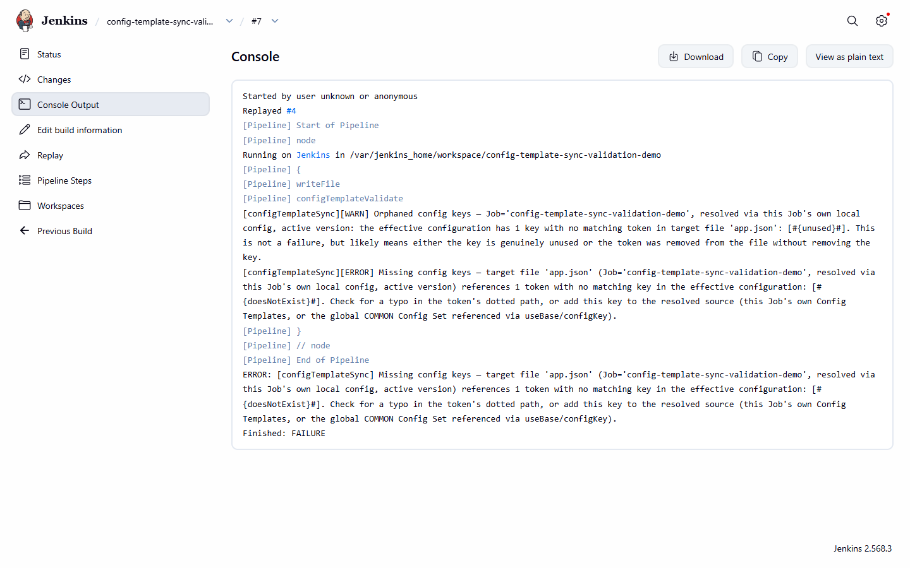
*A real FAILURE build console: the missing-key fatal error, naming the exact unresolved token.*

*Example (orphaned key, non-fatal):* the Job's own config is `{"a":1,"unused":2}` while the
template only references `#{a}#`. Build succeeds, console warns naming `unused` as orphaned.
Demonstrated live by `config-template-sync-validation-demo`, build #2. Screenshot: [build console
showing resolution-mode wording](docs/screenshots/06-build-console-resolution-mode.png).

### More admin UI capabilities

Two admin UI features referenced throughout the flows above, shown here on their own:

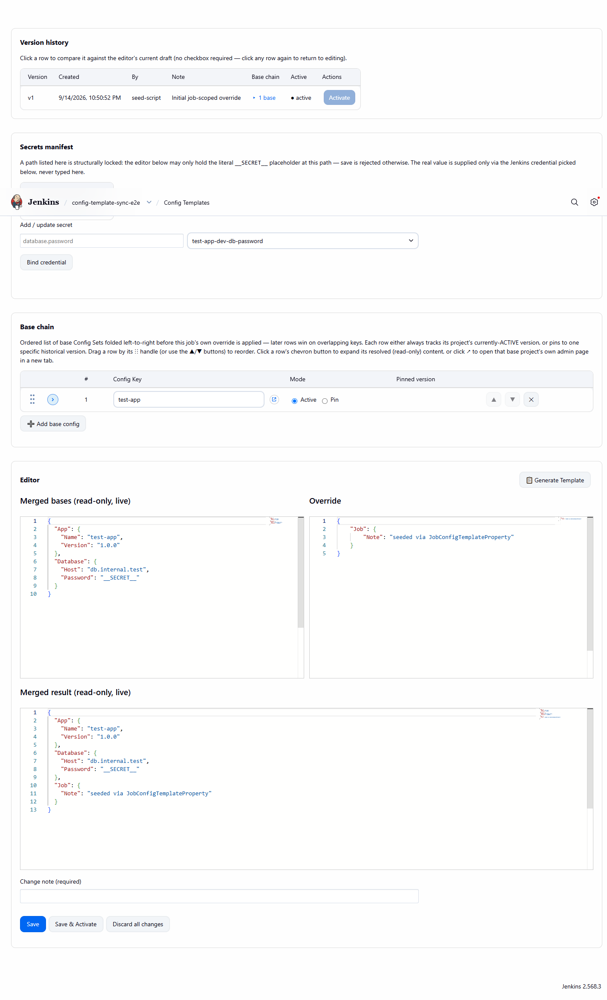
*The debounced three-panel RFC 7396 merge preview — merged bases, own override, merged result —
useful while editing a base-chain entry or override content before saving (used while working
through steps 6-7 of [Getting started](#getting-started)).*

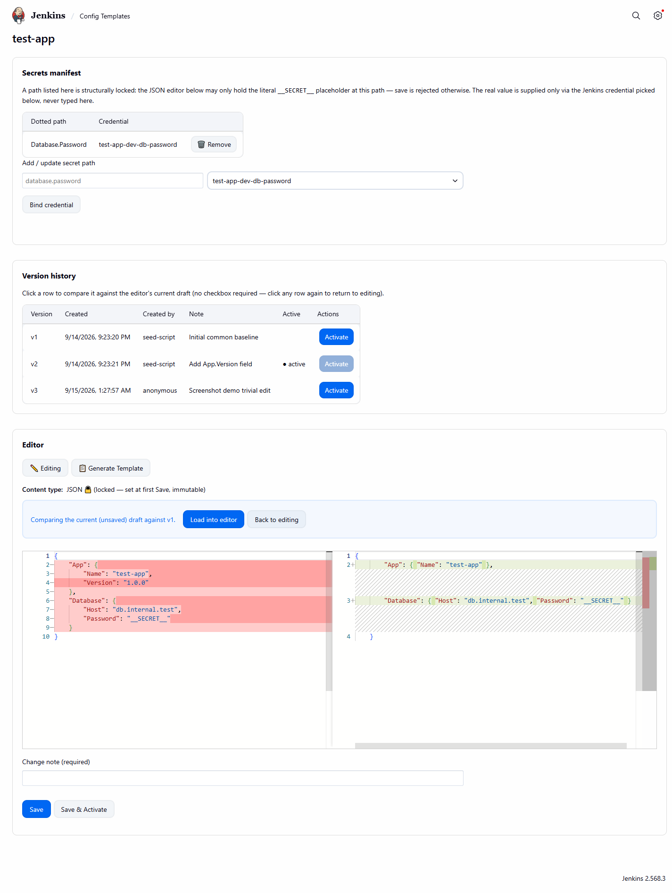
*Compare mode: a version diff view, useful when confirming exactly what changed before or after a
rollback (see [UF-5](#uf-5--roll-back-a-bad-config-change)).*

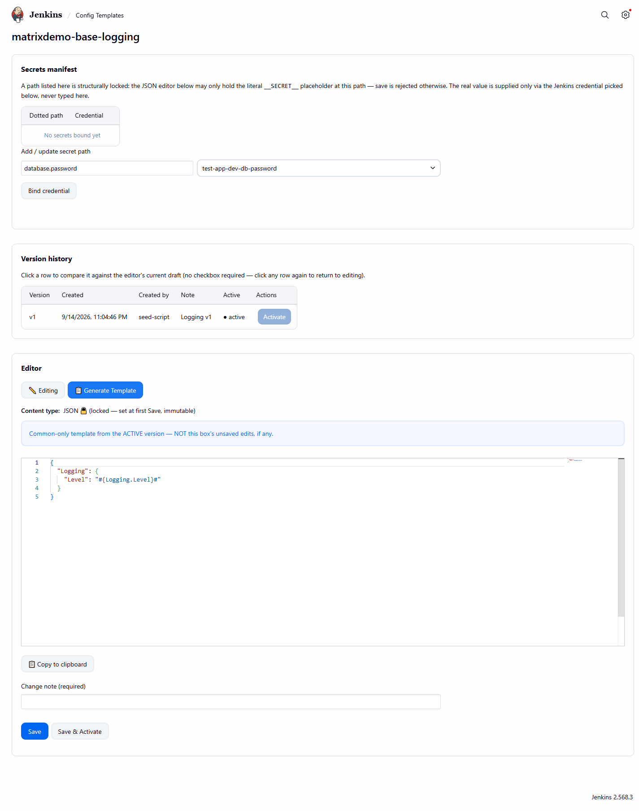
*The "Generate Template" tokenized output panel — the paste-ready block referenced in
[UF-2](#uf-2--get-the-exact-template-to-paste-into-your-apps-config-file).*

## Publishing

Not yet on the official Jenkins Update Center — see [HOSTING.md](HOSTING.md) for the current
hosting-request prerequisites and process.

## License

MIT — see [LICENSE](LICENSE).

## Contributing

Issues and pull requests are welcome. Please:

1. Open an issue describing the bug/feature before starting significant work.
2. Keep changes focused — one logical change per PR.
3. Run `./mvnw clean verify` (or `./docker-build.sh`) locally before submitting, and make sure
   existing tests still pass.
4. Follow the existing code style and, where relevant, the domain-model vocabulary used throughout
   this README and the plugin's own error messages (`Config Key`, `Config Set`, `base chain`,
   `effective configuration`, etc.).
