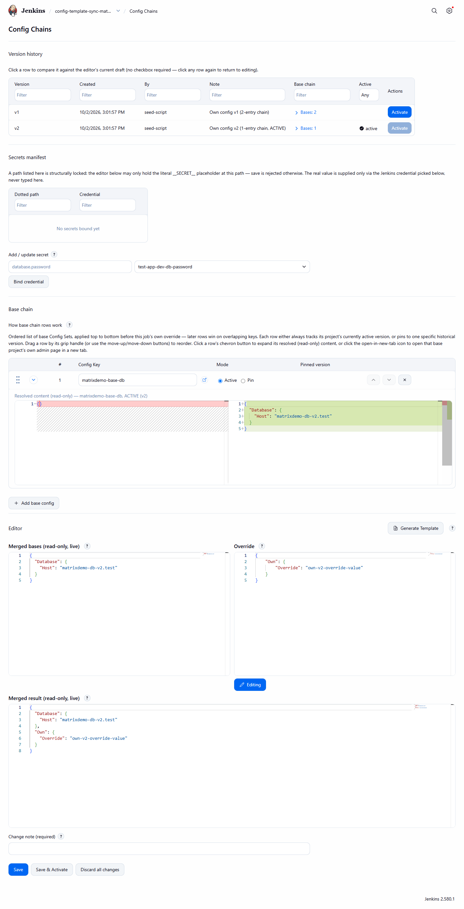

# Base chain and override

[Concepts](README.md) · [Merging and arrays](merging-and-arrays.md)

A job's **effective configuration** is composed from two things:

1. The **base chain**: an ordered list of common Config Sets. Each entry either *follows the active version* of
   its Config Set or is *pinned* to one specific version. Entries are applied top to bottom, so a later entry
   wins on overlapping keys.
2. The job's own **override** content, applied last.

The layers are combined with [RFC 7396 Merge Patch](merging-and-arrays.md).

*A base-chain row expanded with its chevron: the resolved, read-only content of that entry.*

A job can be in any of three equally valid states, and can move between them at any time:

| State | Base chain | Own override | Effective configuration |
|---|---|---|---|
| Nothing configured | empty | empty | empty (valid, not an error) |
| Base chain, optional override | one or more entries | optional | folded chain, then the override applied last |
| Override only | empty | present | the override itself |

Every saved job version records its own base chain, so an old version can be resolved exactly as it was saved
(see [resolution matrix](../pipeline/resolution-matrix.md)).

The job page that edits the base chain and override exists on **Pipeline jobs only** (including multibranch
branch jobs) and requires the Administer permission; see [Job page](../user-guide/job-page.md).
