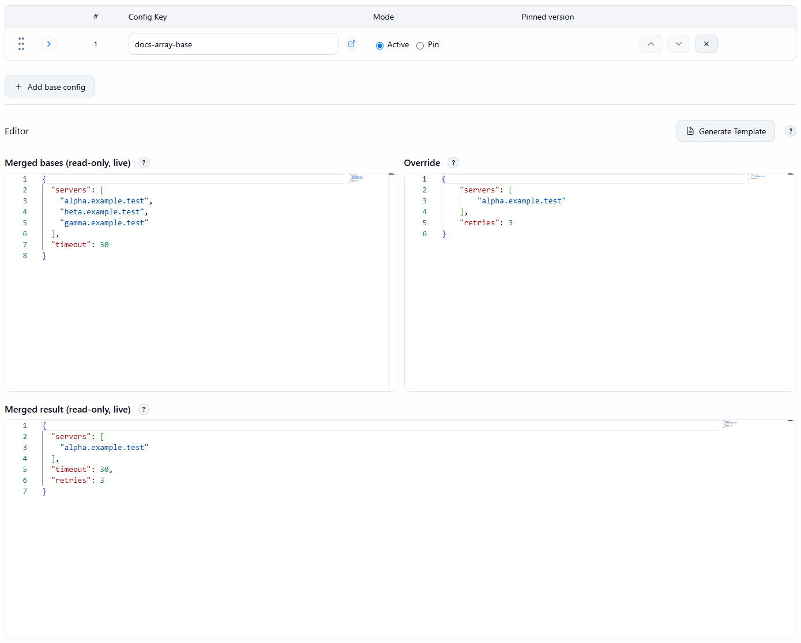

# Merging and arrays (RFC 7396)

[Concepts](README.md) · [Base chain and override](base-chain-and-override.md)

Config layers are combined with RFC 7396 Merge Patch. Objects are merged key by key; a later layer's value wins
on a conflicting key.

## Arrays are replaced wholesale

When an overlay (a job's own override, or a later base-chain entry) contains a JSON array, that array
**replaces** the one below it as a whole; arrays are never merged element by element. To change one element of
an array, repeat the complete array in the overlay.

*The base holds three `servers`; the override holds one. The merged result has only the override's array, while `timeout` (base) and `retries` (override) are combined key by key.*

The live three-panel merge preview in the editors shows exactly this result before you save; see [Merge
preview](../user-guide/merge-preview.md).
