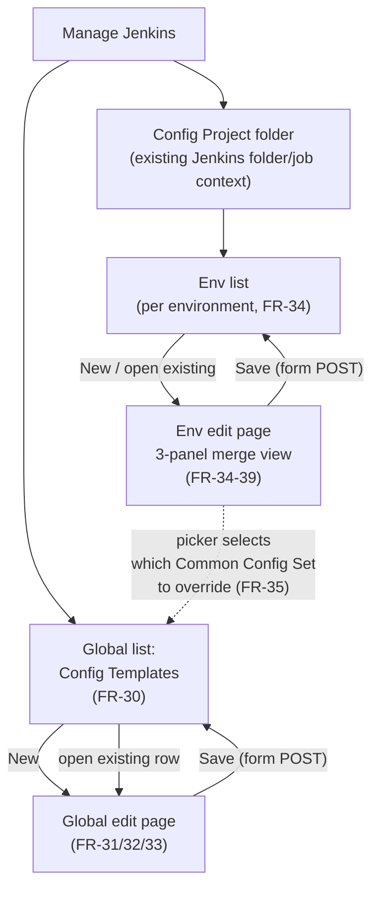
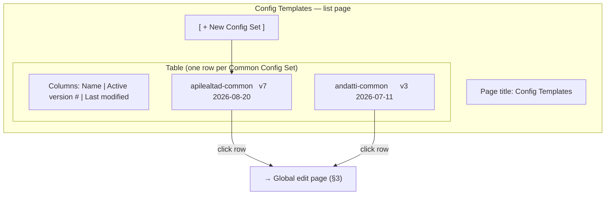
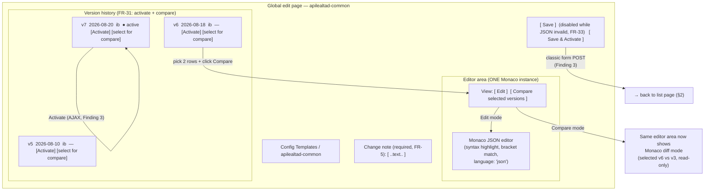
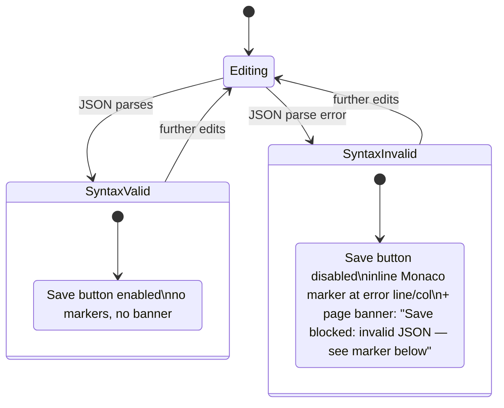
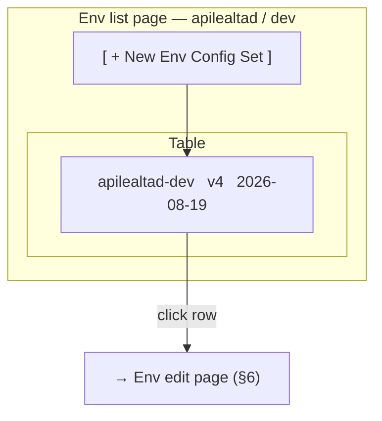
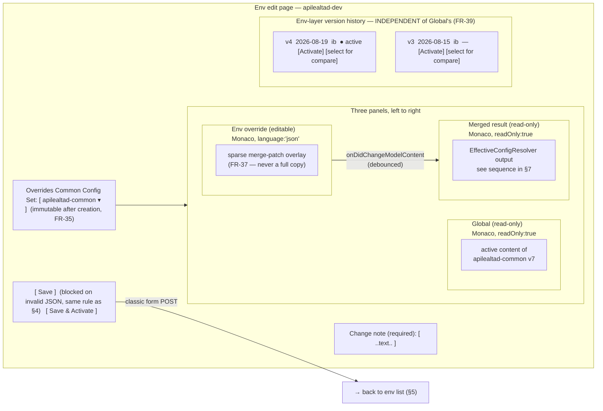
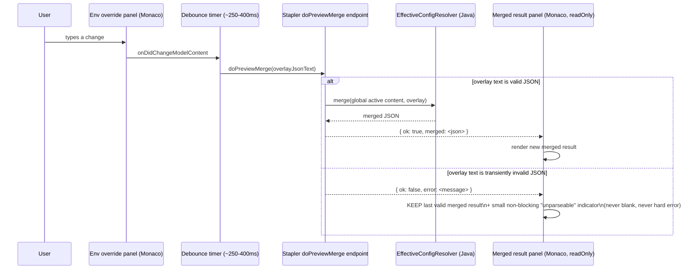
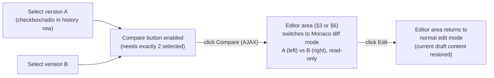

# Wireframe — Config Templates Admin UI (Global + Env level)

> **Relabeling note (2026-08-27, owner correction):** despite the filename/title, this document is
> **interaction/process-flow documentation** (navigation between pages, save/activate/compare round-trips,
> the live-preview sequence diagram) — it does NOT show spatial layout (where regions sit on the page) and
> should not be treated as "the wireframe." It remains valid and useful as process documentation. The
> actual spatial-layout wireframe is `wireframe-layout.md` in this same folder — use that file for "where
> does X sit on the screen" questions.
>
> Status: DRAFT for approval. Plain structural wireframe only (Markdown + Mermaid), per the space rule
> `wireframe-before-visual-design` — no color, no styled boxes, no HTML/CSS. Third attempt after two
> rejections (styled HTML/CSS mockup, then plain ASCII-art). Covers FR-30–FR-39 from
> `docs/business/requirements.md` and the OQ-9 / Finding 1–5 decisions from
> `docs/development/tech-lead-ui-review-2026-08-27.md`. Structural principle carried over from the Rojet
> reference (`ui-12-one-editor.md`): **one editor instance per concept, comparison is a mode/action on an
> existing element, never a duplicate second component**, and no field is shown twice on the same page.

<site-map>

## 1. Site map — how the two pages relate

Two independent admin screens, reached from Jenkins' own "Manage Jenkins" navigation (mirroring the
Managed Files entry point per FR-30). The env-level screen references (never duplicates) a Common Config
Set chosen from the global list.

</site-map>

<page-1-global>

## 2. Page 1 — Global "Config Templates" — list view (FR-30)

Same interaction shape as Jenkins' own Manage Jenkins → Managed Files list: one table, one "New" action,
each row opens the same edit page used for creation.

</page-1-global>

<page-1-edit>

## 3. Page 1 — Global Config Set edit view (FR-31, FR-32, FR-33)

One page, one Monaco editor instance (`language: 'json'`, FR-32), one version-history table beneath it.
"Compare" is a **mode** of the same version-history selection, not a second editor — pick two rows and the
existing editor area switches to Monaco's built-in diff mode (tech-lead Finding 5).

</page-1-edit>

<page-1-save-validation>

## 4. Save validation states (FR-33) — inline Monaco marker + page-level summary

Chosen approach (tech-lead Finding 2): **inline Monaco marker is primary** (squiggle + gutter dot at the
exact line/column of the JSON parse error, since Monaco supports this natively and any standard JSON
parser reports line/column) **plus a one-line page-level banner as a summary/fallback**, so the failure is
visible even if the user has scrolled the editor away from the error line. Save stays disabled until valid.

</page-1-save-validation>

<page-2-env-list>

## 5. Page 2 — Env level — list view (FR-34)

Identical shape to §2, scoped to one (Config Project, environment) pair — same table columns, same "New"
action, listing Env Config Sets instead of Common Config Sets.

</page-2-env-list>

<page-2-edit>

## 6. Page 2 — Env edit page — 3-panel merge view (FR-35, FR-36, FR-37, FR-38)

One page. A picker at the top selects the paired Common Config Set (FR-35, set once at creation, no second
pairing mechanism). Below it, three panels left-to-right modeled on a git 3-way merge view: **Global
(read-only)** | **Env override (the only editable Monaco instance on this page)** | **Merged result
(read-only, live-recomputed)**. The Merged panel is driven entirely by the env-override panel's content —
it is not a separate editor a user types into.

</page-2-edit>

<live-preview-sequence>

## 7. Live merge-preview round trip (FR-38, OQ-9 resolution) — `doPreviewMerge`

Server-side only, per the tech-lead's OQ-9 resolution: every recompute — including this live UI preview —
calls the same `EffectiveConfigResolver` Java class the pipeline steps use, via a debounced Stapler
`doPreviewMerge` AJAX call (same pattern as Jenkins core's own `doCheckXxx` live-validation). While the
override text is transiently invalid JSON mid-edit, the Merged panel keeps showing the **last valid**
result instead of blanking or erroring (tech-lead Finding 1).

</live-preview-sequence>

<compare-interaction>

## 8. Compare interaction (both pages, FR-7 / FR-31 / FR-34 / FR-39)

Same mechanic on both the global edit page (§3) and the env edit page (§6): select two rows in whichever
version-history table is on that page, then the page's one editor area switches into Monaco's diff mode —
no separate diff page, no modal.

</compare-interaction>

<states-summary>

## 9. States covered

- **Global list (§2):** default (rows present), empty (no Config Sets yet — table shows only the "+ New"
  action), loading (table skeleton while fetching), no error state needed (read-only GET).
- **Global edit (§3):** create-new (blank editor, no history section), edit-existing (editor pre-filled,
  history populated), valid/invalid JSON (§4), save-in-flight (Save button disabled + spinner during form
  POST), save-success (redirect to list, per Finding 3), compare mode vs. edit mode (§8).
- **Env edit (§6):** same create/edit/valid/invalid/save states as global edit, applied to the override
  panel only; additionally the Merged panel has its own valid/last-valid-retained/loading-recompute states
  (§7), and the picker has a locked (post-creation) state (FR-35, Finding 4).

</states-summary>
