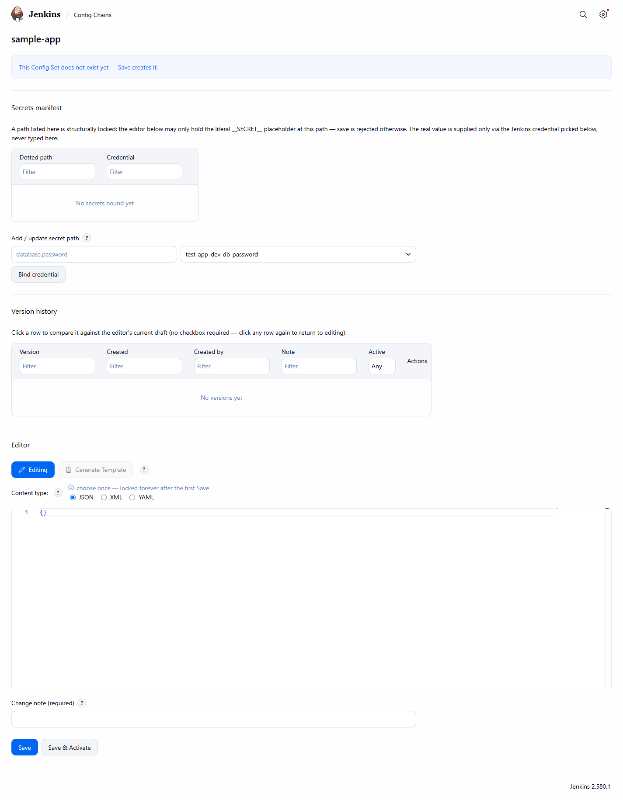
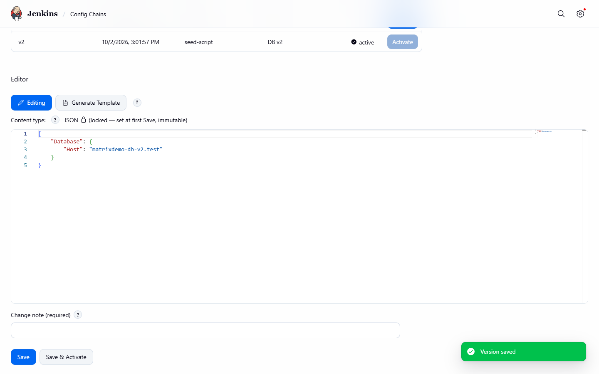
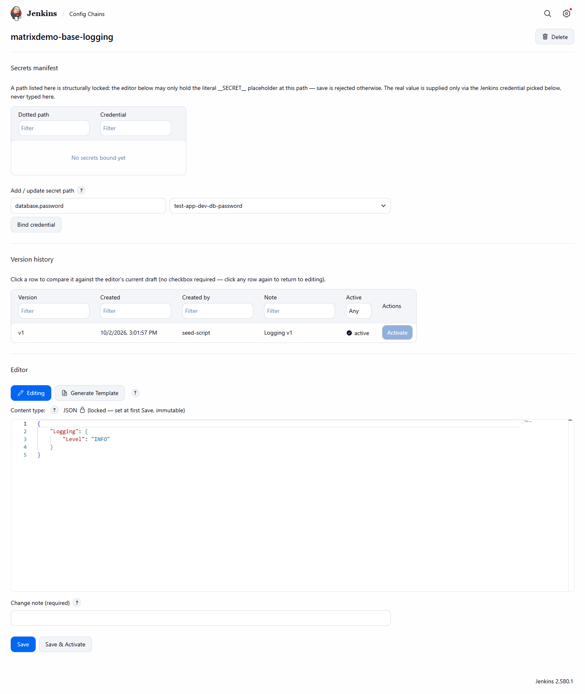
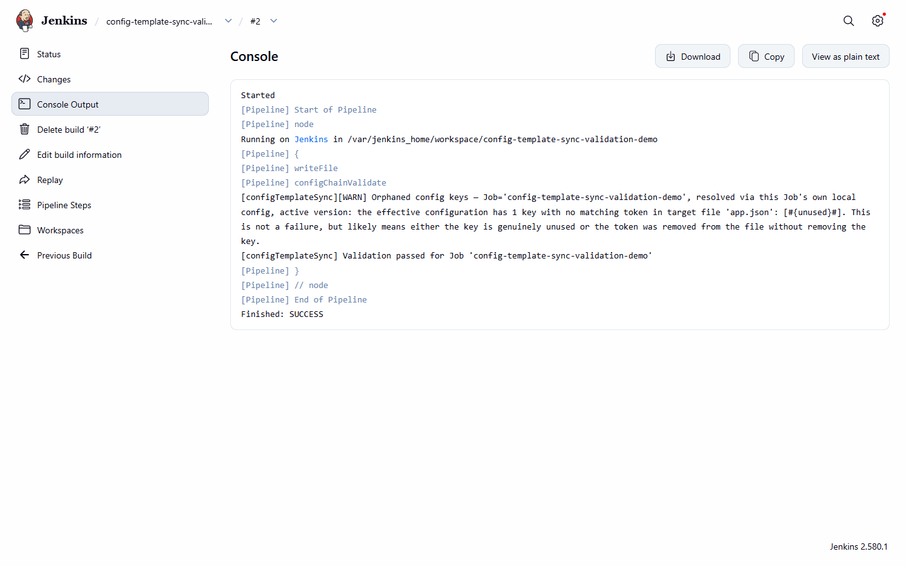

# Getting started

[Back to the README](../README.md) · [Pipeline step reference](pipeline-steps.md) · [Use cases](use-cases.md)

A from-scratch walkthrough, from install to the first successful build.

**1. Install the plugin.** See [Install](../README.md#install).

**2. Create your first Config Key (Common Config Set).** On the global `/configChains` page,
click "New Config Set," give it a name (e.g. `sample-app`), and submit the creation form:


*The "New Config Set" creation form, pre-submit.*

**3. See its empty version history.** A brand-new Config Set has no saved versions yet — this is
a normal, valid starting state, not an error:


*A near-empty version history table right after creation, before the first save.*

**4. Write and save your first version.** Open the Config Set's editor, enter its nested baseline
content (e.g. `{"Database":{"Host":"db.internal"}}`), and save with a change note. Optionally
activate it immediately:


*Editing a Common Config Set's nested content, version history, and secrets manifest.*

A successful save is confirmed with a native Jenkins toast:


*A native Jenkins toast confirming a successful save.*

**5. Add a secret binding.** Mark any leaf that holds a credential (e.g. a connection password) as
secret and bind it to a Jenkins credential ID — never a real value:


*The add-secret form: a dotted-path field plus a Jenkins credential picker.*

**6. Attach the target Job's own Config Chains page.** On the Job that will consume this
config, open `/job/<name>/configChains`:


*A Job's own `/configChains` page — its base chain plus its own override content, side by
side.*

**7. Add a base-chain entry.** Reference the Config Key created in step 2 (`ACTIVE`, or pinned to
a specific version) via the base-chain "add row" picker:


*The base-chain "add row" Config Key picker, expanded.*

Optionally add this Job's own override content (e.g. `{"Own":{"Override":"own-value"}}`), then
save a version for the Job.

**8. Write a minimal Jenkinsfile** calling the pipeline steps:

```groovy
pipeline {
  agent any
  stages {
    stage('Prepare config') {
      steps {
        configChainValidate(file: 'app.json')
        configChainSubstitute(file: 'app.json')
      }
    }
  }
}
```

`configChainValidate` fails the build if `app.json` references a `#{Path}#` token with no
matching key in the effective (merged) configuration. `configChainSubstitute` then resolves
secrets from their bound Jenkins credentials and substitutes every token in place.

**9. Trigger a build and read the console output.** The build console names exactly which
resolution-matrix row the call hit, in the current `#{...}#`-wrapped message format:


*A build console log naming exactly which resolution-matrix row a pipeline call hit.*

That's a complete round trip — Config Key created, versioned, secret-bound, attached to a Job,
and successfully resolved by a real pipeline build.
