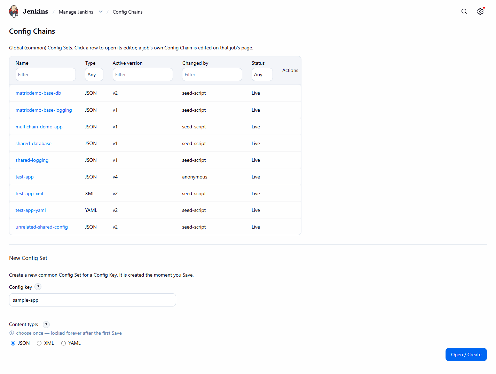
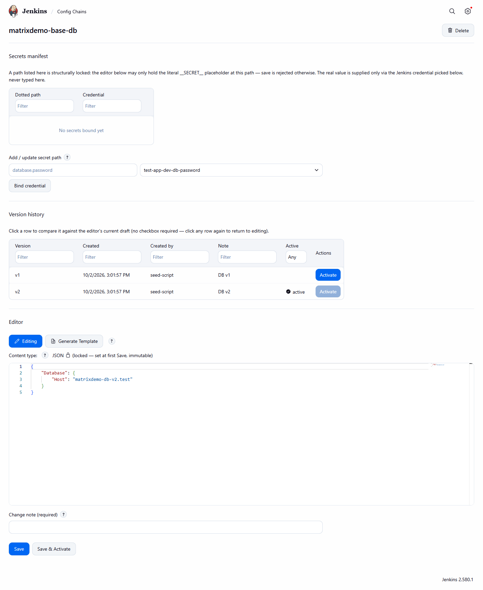
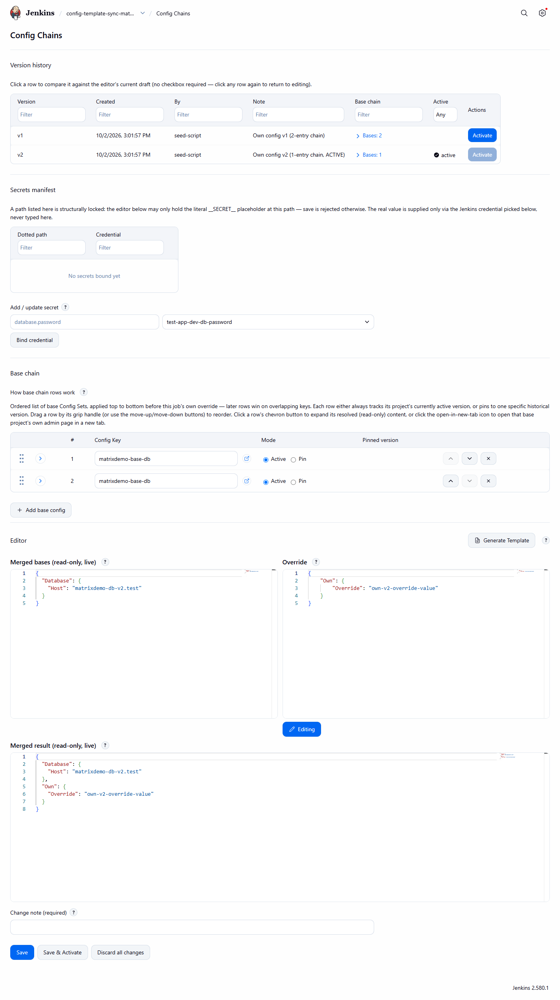

# Getting started

[Guide home](../README.md) · [Concepts](../concepts/README.md) · [User guide](../user-guide/README.md) · [Pipeline reference](../pipeline/README.md)

A from-scratch walkthrough, from install to the first successful build.

**1. Install the plugin.** See [Install](../../README.md#install).

**2. Create your first Config Key (Common Config Set).** Open **Manage Jenkins -> Config Chains**
(`/configChains`), type a name (for example `sample-app`) into the **Config key** field of the *New Config Set*
form, choose the content type (JSON, XML or YAML - it is locked after the first save) and click
**Open / Create**:


*The "New Config Set" form below the list of Config Sets, filled in before submitting.*

**3. See its empty version history.** A brand-new Config Set has no saved versions yet - this is a normal, valid
starting state, not an error:


*A near-empty version history table right after creation, before the first save.*

**4. Write and save your first version.** In the Config Set's editor, enter its nested baseline content (for
example `{"Database":{"Host":"db.internal"}}`), type the required change note and save. Optionally activate it
immediately with **Save & Activate**:


*The Config Set editor: secrets manifest, version history and content editor (see [Config Set
editor](../user-guide/config-set-editor.md)).*

A successful save is confirmed with a native Jenkins toast:


*A native Jenkins toast confirming a successful save.*

**5. Add a secret binding.** Mark any leaf that holds a credential (for example a connection password) as secret
and bind it to a Jenkins credential ID - never a real value (see [Secrets and
credentials](../concepts/secrets-and-credentials.md)):


*The add-secret form: a dotted-path field plus a Jenkins credential picker.*

**6. Open the consuming job's own Config Chains page.** On the Pipeline job that will consume this config, open
`/job/<name>/configChains`:


*A job's own `/configChains` page: version history, secrets manifest, base chain and the job's own override
content (see [Job page](../user-guide/job-page.md)).*

**7. Add a base-chain entry.** Reference the Config Key created in step 2 (following the active version, or
pinned to a specific one) via the **Add base config** row picker:


*The base-chain "add row" Config Key picker, expanded.*

Optionally add this job's own override content (for example `{"Own":{"Override":"own-value"}}`), then save a
version for the job.

**8. Write a minimal Jenkinsfile** calling the pipeline steps:

```groovy
pipeline {
  agent any
  stages {
    stage('Prepare config') {
      steps {
        configChainValidate(file: 'app.json')
        configChainSubstitute(file: 'app.json')
      }
    }
  }
}
```

`configChainValidate` fails the build if `app.json` references a `#{Path}#` token with no matching key in the
effective (merged) configuration. `configChainSubstitute` then resolves secrets from their bound Jenkins
credentials and substitutes every token in place.

**9. Trigger a build and read the console output.** The build console names exactly which resolution-matrix row
the call hit:


*A build console log naming exactly which resolution-matrix row a pipeline call hit (see [Resolution
matrix](../pipeline/resolution-matrix.md)).*

That is a complete round trip: Config Key created, versioned, secret-bound, attached to a job and resolved by a
real pipeline build. Next: [Concepts](../concepts/README.md) or the [use cases](../use-cases/README.md).
