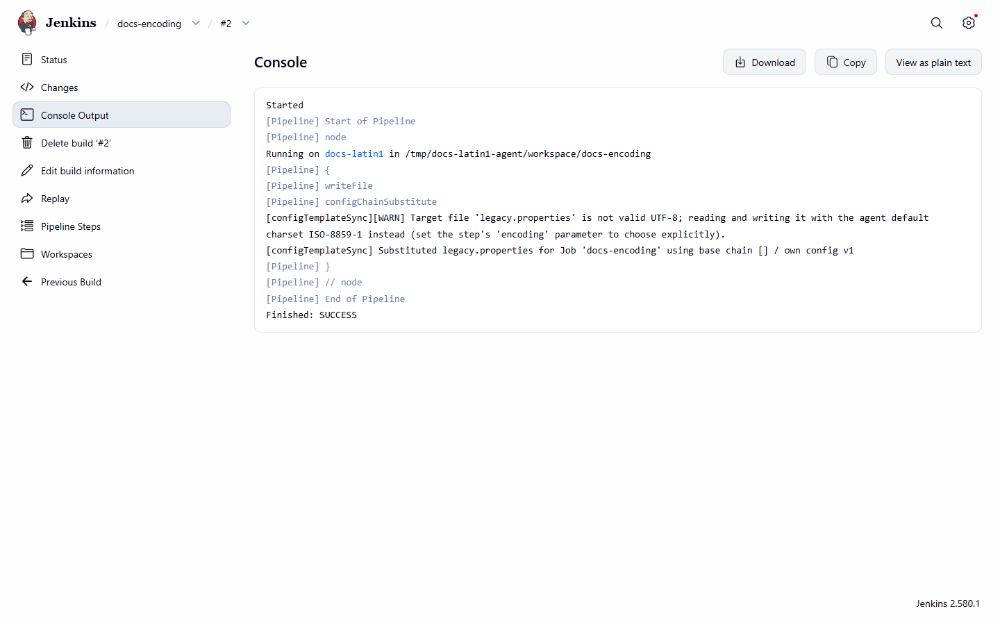

# File encoding

[Pipeline reference](README.md) · [Substitution](substitution.md)

Both `configChainValidate` and `configChainSubstitute` read the target file as **UTF-8**, and
`configChainSubstitute` writes it back as UTF-8, regardless of the agent's platform charset. A file that is not
valid UTF-8 is not a new failure: the step logs a warning naming the file and falls back to the agent's default
charset, which is how earlier releases behaved.

*The fallback warning, from an agent whose default charset is ISO-8859-1.*

The optional `encoding` parameter (for example
`encoding: 'ISO-8859-1'`) overrides this: the named charset is used for reading and writing, with no fallback
and no warning, and an unknown name fails the build. A byte-order mark is neither added nor removed.
