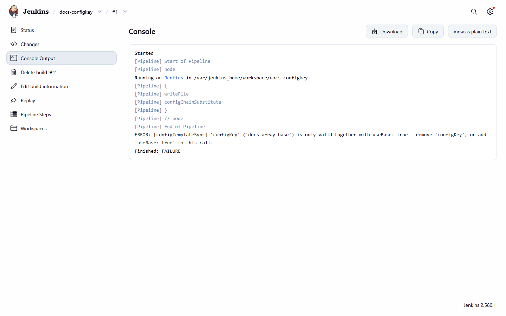
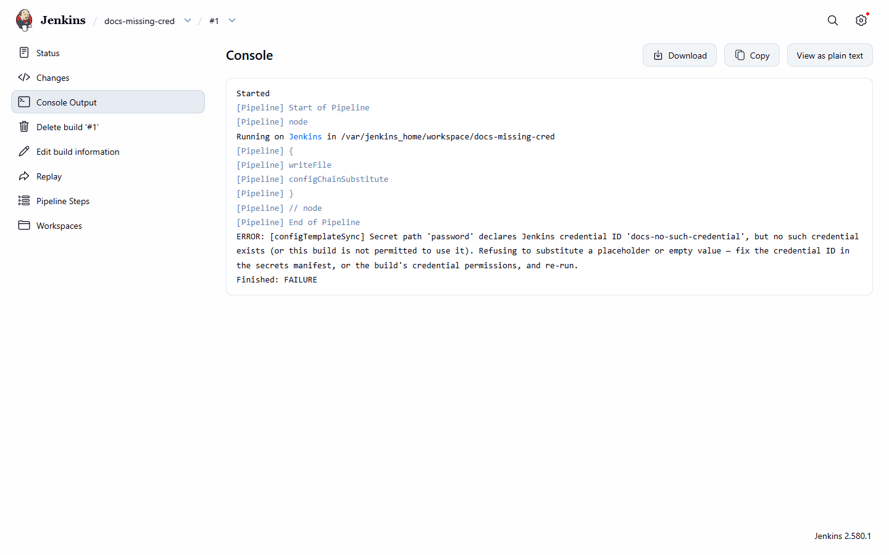
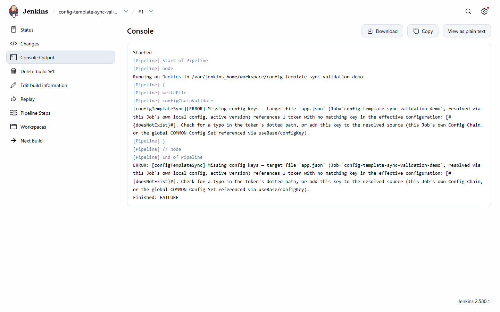

# Failure messages

[Pipeline reference](README.md) · [Troubleshooting](../troubleshooting/README.md)

Build-log messages of the steps carry the `[configTemplateSync]` prefix.

## Fail-loud paths

- **`configKey` without `useBase: true`:**
  `[configTemplateSync] 'configKey' ('<value>') is only valid together with useBase: true — remove
  'configKey', or add 'useBase: true' to this call.`
  
  *The abort for `configKey` without `useBase: true`.*
- **`configKey` names a Config Set that doesn't exist:**
  `[configTemplateSync] No global COMMON Config Set found for configKey '<value>'.`
- **`file` missing from both the call site and any prior `setupConfigChain` call:** an `AbortException` naming
  `file` as the missing required parameter.
- **Missing-key drift (fatal, `configChainValidate`):** `Missing config keys — target file '<file>'
  (Job='<jobFullName>', resolved via <resolution mode>) references <N> token(s) with no matching key in the
  effective configuration: <list>. Check for a typo in the token's dotted path, or add this key to the resolved
  source described above.`
- **Orphaned-key drift (non-fatal, warning only):** `Orphaned config keys — Job='<jobFullName>', resolved via
  <resolution mode>: the effective configuration has <N> key(s) with no matching token in target file '<file>':
  <list>. This is not a failure, but likely means either the key is genuinely unused or the token was removed
  from the file without removing the key.`
- **Unresolved token remains after substitution:** the substitute step fails loudly rather than leaving
  `#{...}#`-shaped text in the output file.
- **Missing secret credential:** the build fails loudly naming the credential ID; it never substitutes a
  placeholder or empty value.

  
  *The missing-credential failure names the secret path and the credential ID.*
- **`setupConfigChain` inside `parallel {}`:** rejected with an `AbortException` naming the branch.

## A real failure

*A real FAILURE build console: the missing-key fatal error, naming the exact unresolved token.*

Scenarios: [Drift outcomes](../use-cases/drift-outcomes.md).
