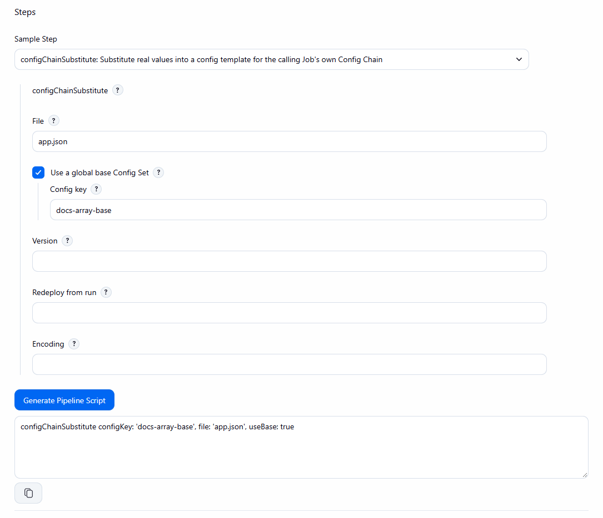

# Snippet Generator and help

[Pipeline reference](README.md) · [Parameters](parameters.md)

Each of the three steps is available in the Jenkins **Pipeline Syntax** Snippet Generator, with help text on
every field. The help is translated into 34 locales.

*`configChainSubstitute` in the Snippet Generator. Ticking **Use a global base Config Set** reveals **Config key**; the generated snippet is shown below the form.*
