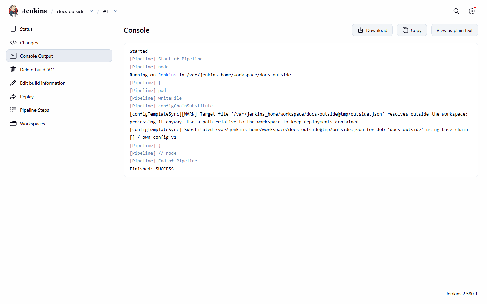

# Substitution

[Pipeline reference](README.md) · [File encoding](encoding.md)

## Substitution is single-pass

The target file is scanned once. Every `#{Path}#` token found in the file as it was read is replaced by its
value, and inserted text is never scanned again, even if a value itself looks like a token (for example a secret
that contains `#{Other.Path}#`). A value is always inserted literally. For ordinary configurations the output is
identical to earlier releases; the only difference is that a value shaped like a token is no longer expanded a
second time.

## Target files should be inside the workspace

`file` is expected to name a file inside the build workspace. If the resolved location (after `..` segments and
symbolic links) is outside it, the step writes a warning to the build log and continues; the build is not failed.

*The outside-workspace warning: the file is processed anyway and the build finishes SUCCESS.*
