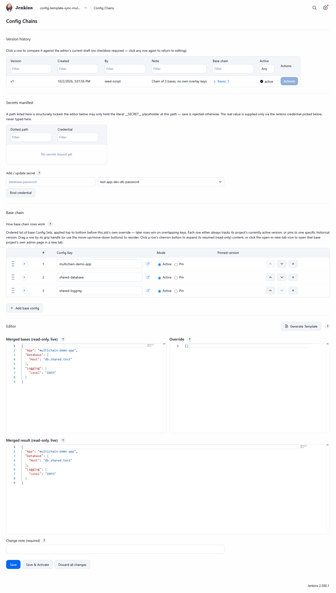
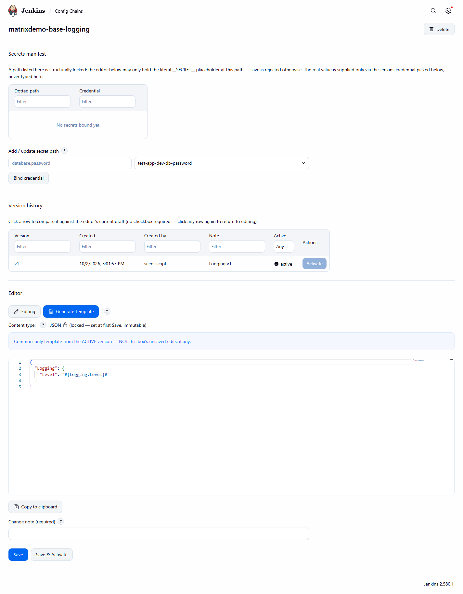

# Use cases

[Back to the README](../README.md) · [Getting started](getting-started.md) · [Pipeline step reference](pipeline-steps.md)

Every scenario below is a `when you need to X, do Y` walkthrough, grouped by theme. Each keeps its
`UF-N` id for traceability back to the use-case catalog and the plugin's own javadoc citations.
Screenshots are woven in at the point they illustrate the described behavior; several screenshots
already shown in [Getting started](getting-started.md) are referenced again here where they're the
best illustration of that use case too.

## Authoring config: adding keys and getting the paste-ready template

### UF-1 — Add a new config key

When you need to introduce a new setting (a feature flag, connection string, or per-Job override),
open the relevant Config Set (common or Job-scoped), add the key at the correct nested path, mark
it secret/non-secret (supplying a Jenkins credential ID if secret — never a real value), and save
a new version with a mandatory change note.

*Example:* open a Common Config Set → add `Feature.NewFlag: true` → save with change note "Add new
feature flag" → optionally activate immediately. Screenshot: [Common Config Set
editor](screenshots/02-common-config-editor.png).

*Outcome:* a new, versioned snapshot exists; "Generate template" returns the same key rendered as
`#{Feature.NewFlag}#`, ready to paste into the app's config file.

### UF-2 — Get the exact template to paste into your app's config file

When an application developer needs the tokens for their config file, request "Generate template"
for the relevant scope and paste the returned block verbatim into the target file.

*Example:* "Generate template" on a Common Config Set returns
`{"Database":{"Host":"#{Database.Host}#"}}`, pasted directly into `appsettings.Production.json`.

*Outcome:* zero hand-typed tokens — the token text is copy-pasted from the system's own output,
eliminating typo drift.

## Deploying: validate then substitute

### UF-3 — Validate config drift before deploying

When your deploy pipeline needs to catch a broken/renamed token before it reaches a live deploy,
call `configChainValidate(file: 'app.json')` before any real substitution.

*Example:*
```groovy
configChainValidate(file: 'app.json')
```
If `app.json` contains `#{doesNotExist}#` with no matching key, the build fails naming
`doesNotExist`. If the effective configuration has an unused key, the build succeeds with a
`[WARN]` naming it — see [UF-23](#uf-23--missing-key-drift-fails-the-build-naming-the-token-orphaned-key-drift-warns-without-failing)
for the exact wording of both outcomes and a real failure console.

*Outcome:* the pipeline proceeds only when no token is left unresolvable.

### UF-4 — Substitute real values at deploy time

Once validation passes, call `configChainSubstitute(file: 'app.json')`.

*Example:*
```groovy
configChainSubstitute(file: 'app.json')
```
*Outcome:* every `#{Path}#` token in `app.json` is replaced with its real value (secrets resolved
from their bound Jenkins credential, never from a stored placeholder), a Deployment Binding is
written recording exactly which versions were used, and the pipeline proceeds to deploy the
substituted file.

## Rollback: reverting config and replaying old builds

### UF-5 — Roll back a bad config change

When a just-activated config version turns out to be broken, open the Config Set's version
history and click "Activate" on a prior version.

*Example:* on a Common Config Set's edit page, select version 3 in the history table → Activate.
The active pointer flips from version 4 back to version 3; no content is duplicated.

*Outcome:* the system confirms which version is now active and shows a diff versus what was active
a moment ago. Activation never triggers a live deploy by itself — the operator must separately
trigger a new deploy for the rollback to reach the running server.

### UF-6 — Roll back a server to an older build with its matching old config

When you redeploy (or reactivate) an older build/version identifier through the normal deploy
pipeline, pass `redeployFromRun` so the matching old config comes back automatically.

*Example:*
```groovy
configChainSubstitute(file: 'app.json', redeployFromRun: 42)
```
*Outcome:* if a Deployment Binding exists for build #42, substitution uses that binding's pinned
versions — not whatever is currently "active." If no binding exists, the system falls back to
currently-active and says so explicitly in the log.

## Resolution-matrix rows — controlling exactly what a call resolves to

All seven rows below are demonstrated live by the `config-template-sync-matrix-demo` job — see
[screenshot 16](screenshots/16-matrix-demo-row-list.png) for its full build history list,
covering every row in one place.

### UF-7 — Default call resolves the calling Job's own active config (matrix row 1)

When you just want the ordinary, no-frills resolution every normal deploy uses, call with only
`file` — no `useBase`, `configKey`, or `version`.

*Example:* a Job's own config has one base-chain entry (`matrixdemo-base-db`@ACTIVE) plus its own
override `{"Own":{"Override":"own-v2-override-value"}}`:
```groovy
configChainSubstitute(file: 'app.json')
```
*Outcome:* both `Own.Override` (from the Job's own content) and `Database.Host` (from the folded
base) land in the substituted file. Demonstrated live by `config-template-sync-matrix-demo`, build
#1 ("ROW1-DEFAULT"). Screenshot: [job-scoped editor](screenshots/03-job-scoped-editor.png).

### UF-8 — Version-pinned own-config call (matrix row 2)

When you need to verify or replay a specific historical own-config version, supply `version: N`
with `useBase` omitted/`false` and `configKey` omitted.

*Example:*
```groovy
configChainSubstitute(file: 'app.json', version: 1)
```
*Outcome:* resolves version 1's own content and its own recorded base chain exactly as saved,
regardless of whichever version is active today. Demonstrated live by
`config-template-sync-matrix-demo`, build #2 ("ROW2-VERSION-PIN").

### UF-9 — `useBase`-only call resolves the Job's own active chain, override ignored (matrix row 4)

When you want only the shared/base configuration, deliberately excluding this Job's own overrides,
call with `useBase: true` and both `configKey`/`version` omitted.

*Example:*
```groovy
configChainSubstitute(file: 'app.json', useBase: true)
```
*Outcome:* resolves `Database.Host` from the base chain but leaves `Own.Override` absent — visibly
different from UF-7's output for the identical Job/version. Demonstrated live by
`config-template-sync-matrix-demo`, build #3 ("ROW4-USEBASE").

### UF-10 — `useBase` + `version`, no `configKey`: pinned own-version's own chain, any length (matrix row 5)

When you need the base chain exactly as it was recorded on one specific past own-config version,
independent of what's active now, supply `useBase: true` and `version: N` together, `configKey`
omitted.

*Example:*
```groovy
configChainSubstitute(file: 'app.json', useBase: true, version: 1)
```
*Outcome:* folds version 1's own 2-entry chain (`matrixdemo-base-db`, `matrixdemo-base-logging`),
producing both `Database.Host` and `Logging.Level` — proving a multi-entry chain pins cleanly.
Demonstrated live by `config-template-sync-matrix-demo`, build #4
("ROW5-USEBASE-VERSION-PIN"). Screenshot: [expanded base-chain
row](screenshots/04-base-chain-expanded-row.png).

### UF-11 — `useBase` + `configKey`: direct global lookup by name, ACTIVE (matrix row 6)

When you need a specific shared/global configuration directly, whether or not it's part of this
Job's own base chain, supply `useBase: true` and `configKey: 'X'`, `version` omitted.

*Example:* `unrelated-shared-config` is never referenced by the calling Job's own chain at all:
```groovy
configChainSubstitute(file: 'app.json', useBase: true, configKey: 'unrelated-shared-config')
```
*Outcome:* still resolves it directly, returning its ACTIVE content — chain membership is not
required. Demonstrated live by `config-template-sync-matrix-demo`, build #5
("ROW6-USEBASE-CONFIGKEY").

### UF-12 — `useBase` + `configKey` + `version`: direct global lookup, pinned (matrix row 7)

When you need a reproducible, specific historical version of a named global configuration, supply
`useBase: true`, `configKey: 'X'`, and `version: N` together.

*Example:*
```groovy
configChainSubstitute(file: 'app.json', useBase: true, configKey: 'unrelated-shared-config', version: 1)
```
*Outcome:* resolves `Shared.Value` from version 1 — visibly different from UF-11's ACTIVE (v2)
output for the identical `configKey`. Demonstrated live by `config-template-sync-matrix-demo`,
build #6 ("ROW7-USEBASE-CONFIGKEY-VERSION-PIN").

## Fail-loud paths and isolation

### UF-13 — `configKey` supplied without `useBase: true` fails loud (matrix row 3)

If you call with `configKey` set but `useBase` omitted or `false`, the build aborts immediately
rather than silently falling through to some other resolution.

*Example:*
```groovy
configChainSubstitute(file: 'app.json', configKey: 'unrelated-shared-config')
```
*Outcome:* aborts with `[configTemplateSync] 'configKey' ('unrelated-shared-config') is only valid
together with useBase: true — remove 'configKey', or add 'useBase: true' to this call.`
Demonstrated live by `config-template-sync-matrix-demo`, build #7 ("ROW3-FAILLOUD").

### UF-14 — `configKey` names a Config Set that doesn't exist as a global COMMON Config Set

If `configKey` was mistyped or never created as a COMMON Config Set, the call fails loud instead
of silently resolving nothing.

*Trigger:* `useBase: true, configKey: 'X'` where no global COMMON Config Set named `X` exists.

*Example:*
```groovy
configChainSubstitute(file: 'app.json', useBase: true, configKey: 'typo-name')
```
*Outcome:* aborts with `[configTemplateSync] No global COMMON Config Set found for configKey
'typo-name'.`

### UF-15 — A call can never reach another Job's own attached config

No parameter combination, on any of the three pipeline steps, can be coerced into naming a target
Job other than the one actually running the step.

*Example:* there is no parameter on any of the three pipeline steps that names a target Job.

*Outcome:* isolation is structural, not a bypassable runtime check — no code path accepts another
Job's identifier. Global COMMON Config Sets remain reachable by any Job via `useBase`+`configKey`
regardless of chain membership (see UF-11) — that is not an isolation violation, since a global
Config Set belongs to no single Job.

### UF-16 — Job has no attached config at all: valid, silent no-op (state 1)

A brand-new Job with nothing configured yet is a valid resolution target, not an error state.

*Trigger:* a resolution-matrix row targeting the Job's own config (rows 1/2/4/5) is called against
a Job with no config property at all, or zero saved versions.

*Example:*
```groovy
configChainValidate(file: 'app.json')  // on a brand-new Job with nothing configured yet
```
*Outcome:* the effective configuration is simply empty — a valid, non-error state. If `app.json`
has zero tokens, this is a silent no-op; if it has one or more tokens, the existing missing-keys
fail-loud path fires naming every such token.

## Build-identity pinning and reproducibility across runs

All two build-pinning scenarios below are demonstrated live by `config-template-sync-rebuild-demo`
— see [screenshot 15](screenshots/15-rebuild-demo-redeploy-console.png) for the build console
of the byte-identical replay in action.

### UF-17 — Same-Run repeat call replays the frozen chain instead of re-resolving live

When a Jenkinsfile restarts from a stage, or calls `configChainSubstitute` more than once in
the same build, the second call reuses the first call's own frozen resolution.

*Trigger:* a second (or later) real-substitution call within the same Run, after an earlier call in
that Run already wrote a Deployment Binding.

*Outcome:* the second call reuses the first call's frozen, already-concrete resolved chain instead
of re-resolving `ACTIVE`/`PINNED` references live — guaranteeing identical effective configuration
across every call in one build, even if a base Config Set's active version changes mid-build.

### UF-18 — `redeployFromRun` replays an earlier Run's frozen chain byte-identically, even after the source changed

When you need to redeploy an older build and get back the config that build actually shipped with
— not whatever is active today — use `redeployFromRun`.

*Trigger:* `configChainSubstitute(..., redeployFromRun: <build-number-or-jobFullName#buildNumber>)`
called from a different Run than the one that originally substituted.

*Example (from `config-template-sync-rebuild-demo`):* build #1 seeds Configuration A (v1); build
#2 (no `redeployFromRun`, after Configuration B/v2 is activated) live-resolves to Configuration B;
build #3:
```groovy
configChainSubstitute(file: 'app.json', redeployFromRun: '1')
```
*Outcome:* build #3 replays build #1's original `x=configuration-A-value` output byte-identically,
despite Configuration B being active by then. The current Run also gets its own fresh Deployment
Binding written, so a future rollback can chain forward and target it too. Screenshot: [rebuild
demo console](screenshots/15-rebuild-demo-redeploy-console.png).

## `setupConfigChain` — declaring parameters once per build

### UF-19 — One `setupConfigChain` call configures every later zero-argument call in the same build

When you don't want to repeat the same parameters on every step call, declare them once at the top
of the Jenkinsfile with `setupConfigChain`.

*Example:*
```groovy
setupConfigChain(file: 'app.json', useBase: true, configKey: 'sample-app')
configChainValidate()
configChainSubstitute()
```
*Outcome:* both later calls read `file`/`useBase`/`configKey` from the stored setup state exactly
as if passed directly.

### UF-20 — Explicit call-site parameters override stored setup state, per parameter

When one specific call needs to diverge from the shared defaults on just one parameter, supply
only that parameter explicitly — the rest still come from `setupConfigChain`.

*Example:*
```groovy
setupConfigChain(file: 'app.json', useBase: true, configKey: 'sample-app')
configChainSubstitute(file: 'override.json')  // useBase/configKey still come from setup
```
*Outcome:* precedence is evaluated per parameter, not all-or-nothing — the explicit `file` is used
together with the stored `useBase`/`configKey`.

### UF-21 — `setupConfigChain` is rejected inside a `parallel {}` block

When building a matrix deploy with `parallel {}`, don't call `setupConfigChain` inside a
branch — its build-scoped state would be ambiguous across concurrently-running branches.

*Example:*
```groovy
parallel(
  dev: { setupConfigChain(file: 'app.json') }  // rejected
)
```
*Outcome:* an `AbortException` naming the branch it was called from. Calls to
`configChainValidate`/`configChainSubstitute` with their own full explicit parameters remain
fully supported and safe inside `parallel {}`.

### UF-22 — Calling `configChainValidate`/`configChainSubstitute` with no `file` from any source fails loud

If `file` is missing from both the call site and any prior `setupConfigChain` call, the build
aborts rather than proceeding with a null/empty/default path.

*Example:*
```groovy
configChainValidate()  // no prior setupConfigChain, no file argument
```
*Outcome:* an `AbortException` naming `file` as the missing required parameter — it never silently
proceeds with a null/empty/default file path.

## Drift outcomes in detail

### UF-23 — Missing-key drift fails the build, naming the token; orphaned-key drift warns without failing

The validate step's flattened expected-keys set is compared against the actual `#{...}#` tokens
found in the target file, producing two independent, non-overlapping outcomes.

*Example (missing key, fatal):* template references `#{doesNotExist}#`, which has no matching key
in the Job's own active config (`{"a":1}`):
```groovy
configChainValidate(file: 'app.json')
```
Build fails, console names `doesNotExist`. Demonstrated live by
`config-template-sync-validation-demo`, build #1 — see the real failure console:


*A real FAILURE build console: the missing-key fatal error, naming the exact unresolved token.*

*Example (orphaned key, non-fatal):* the Job's own config is `{"a":1,"unused":2}` while the
template only references `#{a}#`. Build succeeds, console warns naming `unused` as orphaned.
Demonstrated live by `config-template-sync-validation-demo`, build #2. Screenshot: [build console
showing resolution-mode wording](screenshots/06-build-console-resolution-mode.png).

## More admin UI capabilities

Two admin UI features referenced throughout the flows above, shown here on their own:


*The debounced three-panel RFC 7396 merge preview — merged bases, own override, merged result —
useful while editing a base-chain entry or override content before saving (used while working
through steps 6-7 of [Getting started](getting-started.md)).*


*Compare mode: a version diff view, useful when confirming exactly what changed before or after a
rollback (see [UF-5](#uf-5--roll-back-a-bad-config-change)).*


*The "Generate Template" tokenized output panel — the paste-ready block referenced in
[UF-2](#uf-2--get-the-exact-template-to-paste-into-your-apps-config-file).*
