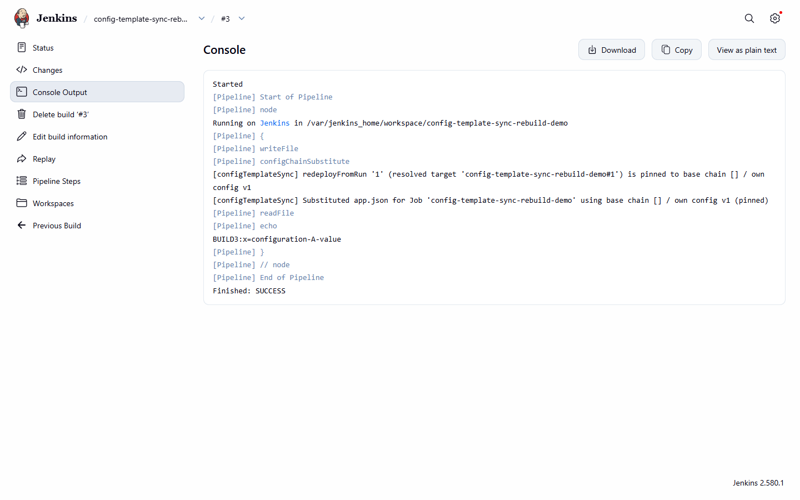

# Build-identity pinning and reproducibility across runs

[Use cases](README.md) · [Guide home](../README.md) · [Pipeline reference](../pipeline/README.md)

All two build-pinning scenarios below are demonstrated live by `config-template-sync-rebuild-demo`
— see [this console](rebuild-redeploy-console.png) for the build console
of the byte-identical replay in action.

## UF-17 — Same-Run repeat call replays the frozen chain instead of re-resolving live

When a Jenkinsfile restarts from a stage, or calls `configChainSubstitute` more than once in
the same build, the second call reuses the first call's own frozen resolution.

*Trigger:* a second (or later) real-substitution call within the same Run, after an earlier call in
that Run already wrote a Deployment Binding.

*Outcome:* the second call reuses the first call's frozen, already-concrete resolved chain instead
of re-resolving `ACTIVE`/`PINNED` references live — guaranteeing identical effective configuration
across every call in one build, even if a base Config Set's active version changes mid-build.

## UF-18 — `redeployFromRun` replays an earlier Run's frozen chain byte-identically, even after the source changed

When you need to redeploy an older build and get back the config that build actually shipped with
— not whatever is active today — use `redeployFromRun`.

*Trigger:* `configChainSubstitute(..., redeployFromRun: <build-number-or-jobFullName#buildNumber>)`
called from a different Run than the one that originally substituted.

*Example (from `config-template-sync-rebuild-demo`):* build #1 seeds Configuration A (v1); build
#2 (no `redeployFromRun`, after Configuration B/v2 is activated) live-resolves to Configuration B;
build #3:
```groovy
configChainSubstitute(file: 'app.json', redeployFromRun: '1')
```
*Outcome:* build #3 replays build #1's original `x=configuration-A-value` output byte-identically,
despite Configuration B being active by then. The current Run also gets its own fresh Deployment
Binding written, so a future rollback can chain forward and target it too. Screenshot: [rebuild
demo console](rebuild-redeploy-console.png).



*The rebuild-demo build console: the replay of an earlier Run's frozen chain.*
