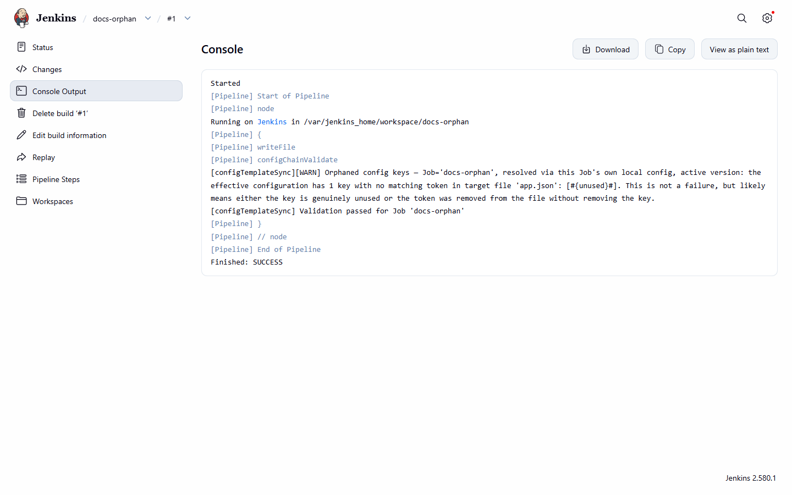

# Drift outcomes in detail

[Use cases](README.md) · [Guide home](../README.md) · [Pipeline reference](../pipeline/README.md)

## UF-23 — Missing-key drift fails the build, naming the token; orphaned-key drift warns without failing

The validate step's flattened expected-keys set is compared against the actual `#{...}#` tokens
found in the target file, producing two independent, non-overlapping outcomes.

*Example (missing key, fatal):* template references `#{doesNotExist}#`, which has no matching key
in the Job's own active config (`{"a":1}`):
```groovy
configChainValidate(file: 'app.json')
```
Build fails, console names `doesNotExist`. Demonstrated live by
`config-template-sync-validation-demo`, build #1 — see the real failure console:


*A real FAILURE build console: the missing-key fatal error, naming the exact unresolved token.*

*Example (orphaned key, non-fatal):* the Job's own config is `{"a":1,"unused":2}` while the
template only references `#{a}#`. Build succeeds, console warns naming `unused` as orphaned.
Demonstrated live by `config-template-sync-validation-demo`, build #2. Screenshot: [build console
showing resolution-mode wording](../pipeline/build-console-resolution-mode.png).


*The orphaned-key warning: the build finishes SUCCESS and the console names `unused`.*

