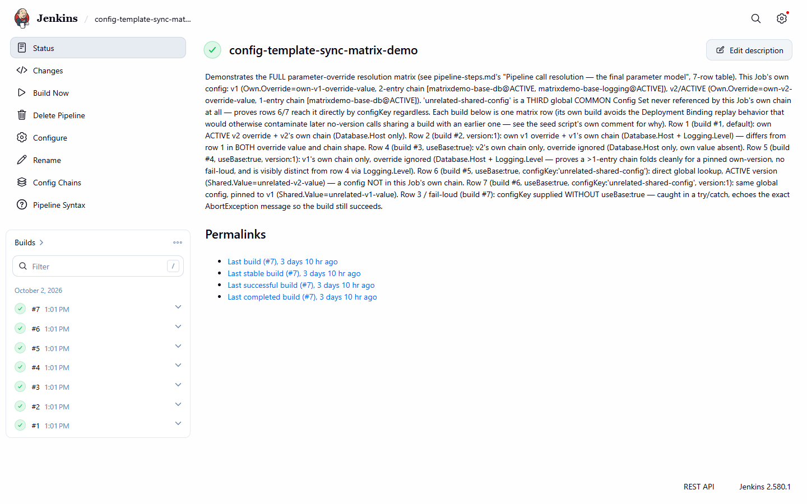

# Resolution-matrix rows — controlling exactly what a call resolves to

[Use cases](README.md) · [Guide home](../README.md) · [Pipeline reference](../pipeline/README.md)

All seven rows below are demonstrated live by the `config-template-sync-matrix-demo` job — see
[this build list](matrix-demo-build-list.png) for its full build history list,
covering every row in one place.

## UF-7 — Default call resolves the calling Job's own active config (matrix row 1)

When you just want the ordinary, no-frills resolution every normal deploy uses, call with only
`file` — no `useBase`, `configKey`, or `version`.

*Example:* a Job's own config has one base-chain entry (`matrixdemo-base-db`@ACTIVE) plus its own
override `{"Own":{"Override":"own-v2-override-value"}}`:
```groovy
configChainSubstitute(file: 'app.json')
```
*Outcome:* both `Own.Override` (from the Job's own content) and `Database.Host` (from the folded
base) land in the substituted file. Demonstrated live by `config-template-sync-matrix-demo`, build
#1 ("ROW1-DEFAULT"). Screenshot: [job-scoped editor](../user-guide/job-page-editor.png).

## UF-8 — Version-pinned own-config call (matrix row 2)

When you need to verify or replay a specific historical own-config version, supply `version: N`
with `useBase` omitted/`false` and `configKey` omitted.

*Example:*
```groovy
configChainSubstitute(file: 'app.json', version: 1)
```
*Outcome:* resolves version 1's own content and its own recorded base chain exactly as saved,
regardless of whichever version is active today. Demonstrated live by
`config-template-sync-matrix-demo`, build #2 ("ROW2-VERSION-PIN").

## UF-9 — `useBase`-only call resolves the Job's own active chain, override ignored (matrix row 4)

When you want only the shared/base configuration, deliberately excluding this Job's own overrides,
call with `useBase: true` and both `configKey`/`version` omitted.

*Example:*
```groovy
configChainSubstitute(file: 'app.json', useBase: true)
```
*Outcome:* resolves `Database.Host` from the base chain but leaves `Own.Override` absent — visibly
different from UF-7's output for the identical Job/version. Demonstrated live by
`config-template-sync-matrix-demo`, build #3 ("ROW4-USEBASE").

## UF-10 — `useBase` + `version`, no `configKey`: pinned own-version's own chain, any length (matrix row 5)

When you need the base chain exactly as it was recorded on one specific past own-config version,
independent of what's active now, supply `useBase: true` and `version: N` together, `configKey`
omitted.

*Example:*
```groovy
configChainSubstitute(file: 'app.json', useBase: true, version: 1)
```
*Outcome:* folds version 1's own 2-entry chain (`matrixdemo-base-db`, `matrixdemo-base-logging`),
producing both `Database.Host` and `Logging.Level` — proving a multi-entry chain pins cleanly.
Demonstrated live by `config-template-sync-matrix-demo`, build #4
("ROW5-USEBASE-VERSION-PIN"). Screenshot: [expanded base-chain
row](../concepts/base-chain-expanded-row.png).

## UF-11 — `useBase` + `configKey`: direct global lookup by name, ACTIVE (matrix row 6)

When you need a specific shared/global configuration directly, whether or not it's part of this
Job's own base chain, supply `useBase: true` and `configKey: 'X'`, `version` omitted.

*Example:* `unrelated-shared-config` is never referenced by the calling Job's own chain at all:
```groovy
configChainSubstitute(file: 'app.json', useBase: true, configKey: 'unrelated-shared-config')
```
*Outcome:* still resolves it directly, returning its ACTIVE content — chain membership is not
required. Demonstrated live by `config-template-sync-matrix-demo`, build #5
("ROW6-USEBASE-CONFIGKEY").

## UF-12 — `useBase` + `configKey` + `version`: direct global lookup, pinned (matrix row 7)

When you need a reproducible, specific historical version of a named global configuration, supply
`useBase: true`, `configKey: 'X'`, and `version: N` together.

*Example:*
```groovy
configChainSubstitute(file: 'app.json', useBase: true, configKey: 'unrelated-shared-config', version: 1)
```
*Outcome:* resolves `Shared.Value` from version 1 — visibly different from UF-11's ACTIVE (v2)
output for the identical `configKey`. Demonstrated live by `config-template-sync-matrix-demo`,
build #6 ("ROW7-USEBASE-CONFIGKEY-VERSION-PIN").



*The `config-template-sync-matrix-demo` job: one build per row.*
