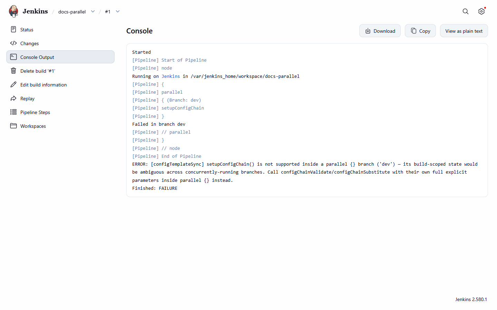

# `setupConfigChain` — declaring parameters once per build

[Use cases](README.md) · [Guide home](../README.md) · [Pipeline reference](../pipeline/README.md)

## UF-19 — One `setupConfigChain` call configures every later zero-argument call in the same build

When you don't want to repeat the same parameters on every step call, declare them once at the top
of the Jenkinsfile with `setupConfigChain`.

*Example:*
```groovy
setupConfigChain(file: 'app.json', useBase: true, configKey: 'sample-app')
configChainValidate()
configChainSubstitute()
```
*Outcome:* both later calls read `file`/`useBase`/`configKey` from the stored setup state exactly
as if passed directly.

## UF-20 — Explicit call-site parameters override stored setup state, per parameter

When one specific call needs to diverge from the shared defaults on just one parameter, supply
only that parameter explicitly — the rest still come from `setupConfigChain`.

*Example:*
```groovy
setupConfigChain(file: 'app.json', useBase: true, configKey: 'sample-app')
configChainSubstitute(file: 'override.json')  // useBase/configKey still come from setup
```
*Outcome:* precedence is evaluated per parameter, not all-or-nothing — the explicit `file` is used
together with the stored `useBase`/`configKey`.

## UF-21 — `setupConfigChain` is rejected inside a `parallel {}` block

When building a matrix deploy with `parallel {}`, don't call `setupConfigChain` inside a
branch — its build-scoped state would be ambiguous across concurrently-running branches.

*Example:*
```groovy
parallel(
  dev: { setupConfigChain(file: 'app.json') }  // rejected
)
```
*Outcome:* an `AbortException` naming the branch it was called from.


*The console of the failing build: `Failed in branch dev` and the error naming the branch.*
 Calls to
`configChainValidate`/`configChainSubstitute` with their own full explicit parameters remain
fully supported and safe inside `parallel {}`.

## UF-22 — Calling `configChainValidate`/`configChainSubstitute` with no `file` from any source fails loud

If `file` is missing from both the call site and any prior `setupConfigChain` call, the build
aborts rather than proceeding with a null/empty/default path.

*Example:*
```groovy
configChainValidate()  // no prior setupConfigChain, no file argument
```
*Outcome:* an `AbortException` naming `file` as the missing required parameter — it never silently
proceeds with a null/empty/default file path.

