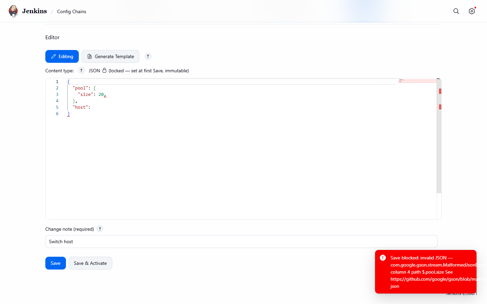

# Config Set editor

[User guide](README.md) · [Manage Jenkins pages](manage-jenkins-pages.md)

Opening a Config Set from the global list shows its editor (also on the `l:settings-subpage` layout).

*The Config Set editor: secrets manifest, version history table and the content editor.*

Sections, top to bottom:

1. **Secrets manifest** - see [Secrets manifest](secrets-manifest.md).
2. **Version history** - see [Version history, compare and rollback](version-history-and-compare.md).
3. **Editor** - a syntax-aware code editor for the Config Set's content type, with the **Editing** / compare
   toggle and **Generate Template** ([Generate Template](generate-template.md)). The content type is shown
   locked.
4. **Change note** (required) and the buttons **Save** and **Save & Activate**. While a save is in flight both
   buttons are disabled. A save is blocked with an error when the content is not syntactically valid for the
   content type.

*A save with invalid syntax is rejected: the editor marks the error and a red toast reports **Save blocked: invalid JSON**; no version is created.*

A successful change is confirmed with a native Jenkins toast. **Delete** (top right) removes the Config Set.
