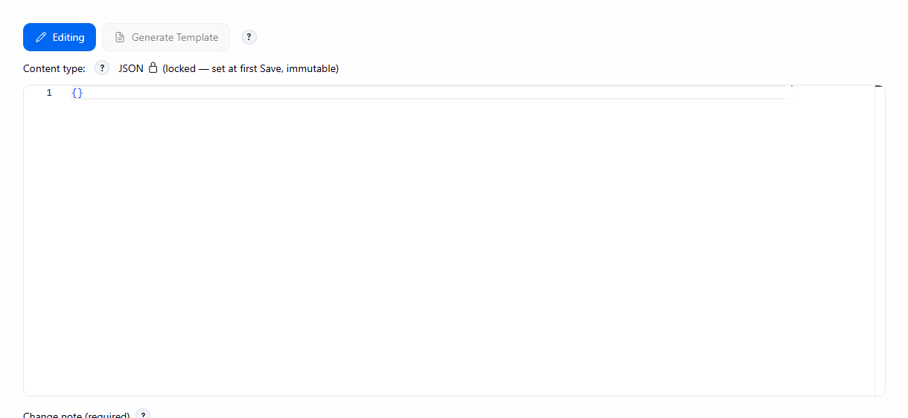

# Generate Template

[User guide](README.md) · [Use case UF-2](../use-cases/authoring.md#uf-2--get-the-exact-template-to-paste-into-your-apps-config-file)

**Generate Template** renders a Config Set's content with every leaf as a `#{Dotted.Path}#` token, ready to paste
into the application's config file. It is a copy-paste source, so no token is typed by hand.

*The tokenized output panel.*

*Generate Template is disabled while the Config Set has no active version; hovering it shows the tooltip "no active version yet".*

- On the **Config Set editor** it is available when the Config Set has an active version (otherwise it is
  disabled with a short explanation) and renders that Config Set alone.
- On the **job page** one button renders the job's effective (merged) configuration.
- The output is read-only with a **Copy to clipboard** action. Secret leaves are rendered as ordinary tokens,
  with no marker, so the copied text stays valid.
