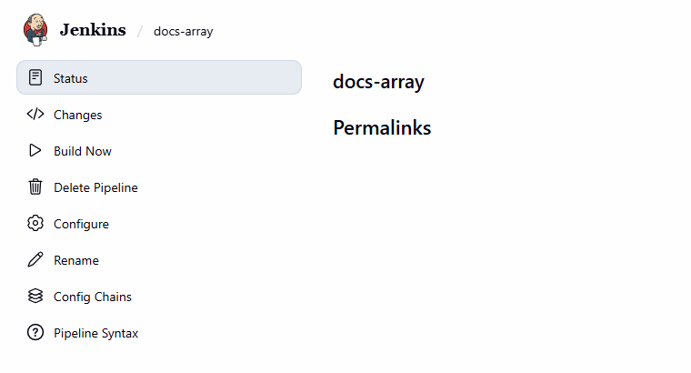
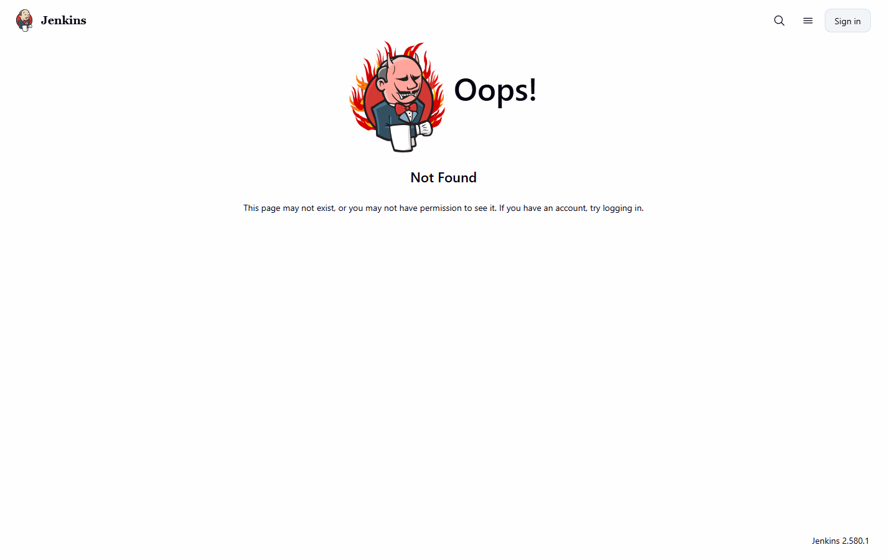
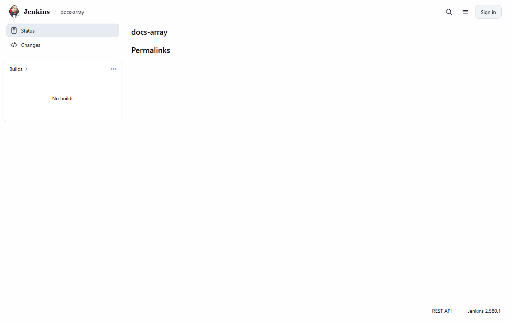
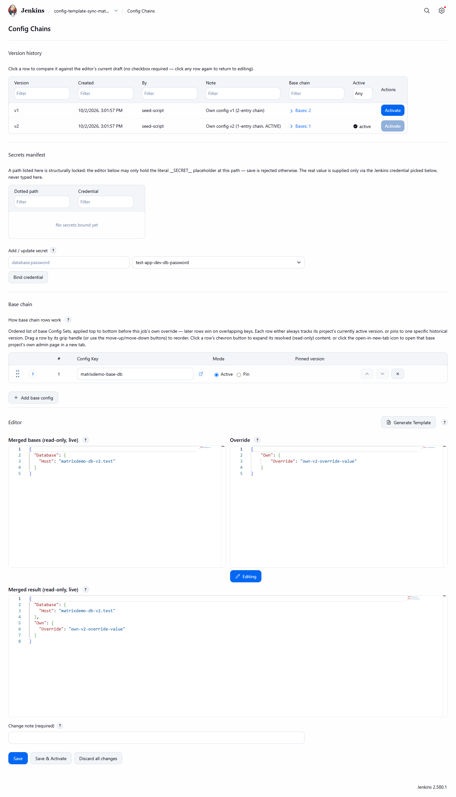

# Job page

[User guide](README.md) · [Base chain and override (concept)](../concepts/base-chain-and-override.md)

Every **Pipeline job** (including multibranch branch jobs) has a **Config Chains** page at
`/job/<name>/configChains`, reached from the job's sidebar. It requires the **Administer** permission - a job's
Configure permission alone is not enough, because a chain can reference any Config Key and a manifest names
credential IDs. The page does not exist on other job types because the configuration is consumed by Pipeline
steps. It keeps the standard job layout (it does not use the Manage Jenkins page shell).

*The **Config Chains** link in a Pipeline job's sidebar.*

A user without the Administer permission does not get the sidebar link, and opening the URL directly returns Jenkins'
 standard Not Found page rather than the editor.

*The same URL for a non-admin visitor: the page is not served.*

*The job's sidebar for that visitor shows only Status and Changes.*

*A job's Config Chains page, top to bottom: version history, secrets manifest, base chain, the three-panel
editor and the change note with Save, Save & Activate and Discard all changes.*

Sections:

1. **Version history** - each row shows version, created, by, note, its recorded base chain and an **Activate**
   action ([Version history, compare and rollback](version-history-and-compare.md)).
2. **Secrets manifest** - [Secrets manifest](secrets-manifest.md).
3. **Base chain** - ordered rows, each with a Config Key picker (with an open-in-new-tab link), **Active** or
   **Pin** mode and a pinned version, move up / move down / remove buttons and drag-to-reorder. A chevron
   expands the row's resolved content. **Add base config** appends a row. Later rows win.
4. **Editor** - merged bases (read-only), the job's own **Override**, and the merged result
   ([Merge preview](merge-preview.md)); **Generate Template** ([Generate Template](generate-template.md)).
5. **Change note** (required), **Save**, **Save & Activate**, **Discard all changes**.

Saving the job's own Jenkins configuration (the job's **Configure** form) never touches this configuration.
The page may be empty, hold only a base chain, only an override, or both; see [three
states](../concepts/base-chain-and-override.md).
