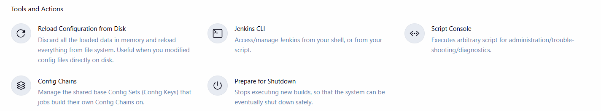
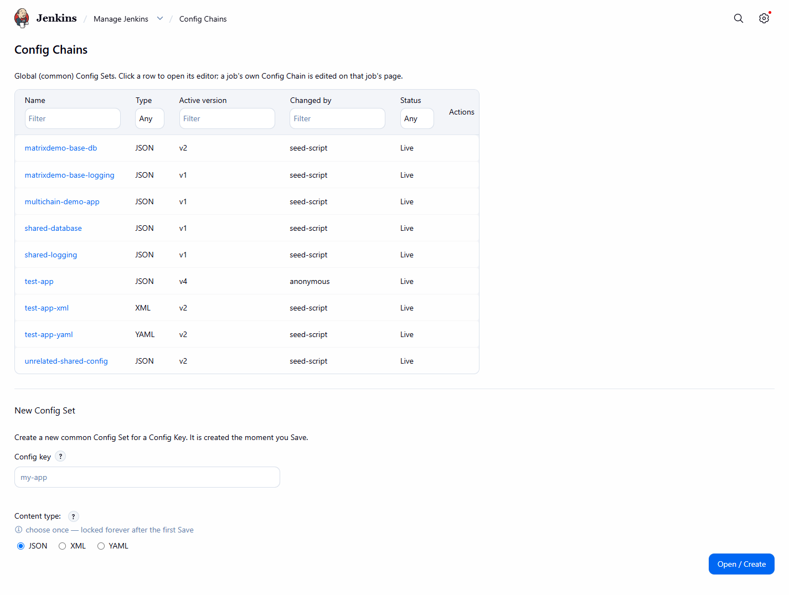

# Manage Jenkins pages

[User guide](README.md) · [Config Set editor](config-set-editor.md)

The global pages live under **Manage Jenkins -> Config Chains** (`/configChains`) and use the Jenkins
`l:settings-subpage` layout (wide where the Jenkins core supports it; otherwise the default width).

*The Config Chains entry on the Manage Jenkins landing page, in the Tools and Actions section.*

*The global Config Chains page: a filterable table of common Config Sets (name, type, active version, changed
by, status) and the "New Config Set" form.*

- **The list** shows every global (common) Config Set. Click a name to open its [editor](config-set-editor.md).
  Each column has a filter.
- **New Config Set** takes the **Config key** and the **Content type** (JSON, XML or YAML, locked after the
  first save). **Open / Create** opens the editor; the Config Set is created at its first save.
- A job's own Config Chain is not edited here but on that job's page: [Job page](../user-guide/job-page.md).
