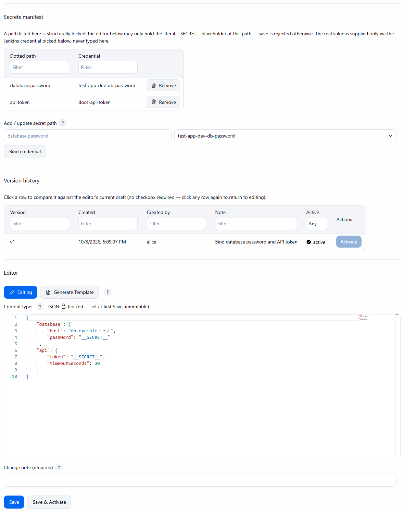

# Secrets manifest

[User guide](README.md) · [Secrets and credentials (concept)](../concepts/secrets-and-credentials.md)

Both the Config Set editor and the job page contain a **Secrets manifest** table (dotted path and bound
credential, both filterable).

*Add / update secret: type the dotted path (for example `database.password`), pick a Jenkins credential and click
**Bind credential**.*

*A populated manifest (`database.password` and `api.token` bound to credentials) and the content editor holding `__SECRET__` at exactly those paths.*

A path listed in the manifest is structurally locked: the content editor may only hold the `__SECRET__`
placeholder at that path, and a save is rejected otherwise. The real value is supplied only by the bound
credential at substitution time.
