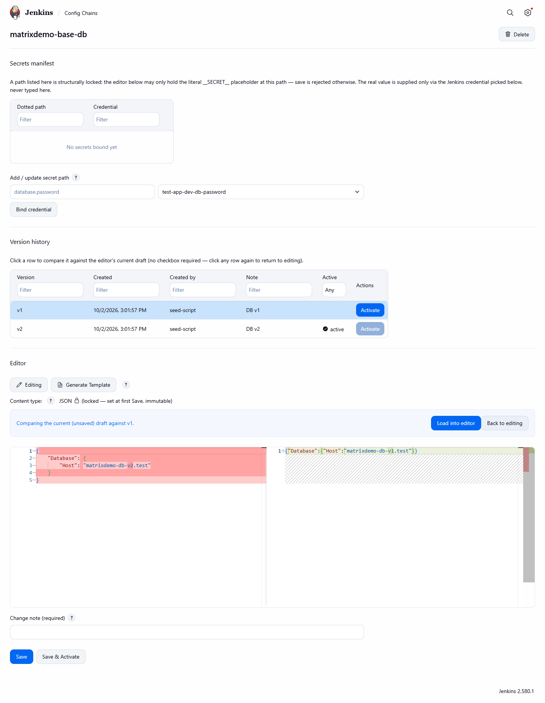
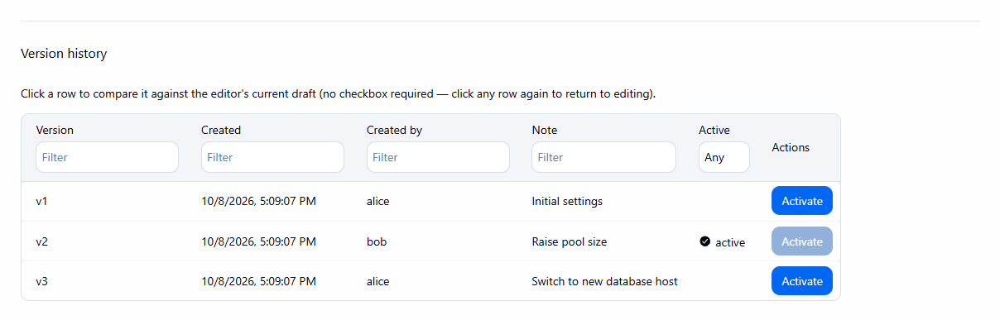

# Version history, compare and rollback

[User guide](README.md) · [Config Sets and versions (concept)](../concepts/config-sets-and-versions.md)

The **Version history** table lists every saved version (version, created, by, note, active marker, and on the
job page its base chain). Each column is filterable.

- **Activate** repoints the active version to that row; nothing is duplicated and nothing is deployed. The
  button of the currently active version is disabled. While an activation is in flight the other Activate
  buttons are disabled too.
- **Compare**: click any row to diff the editor's current draft (including unsaved edits) against that
  version. Click the row again to go back.

*Compare mode: the banner names the compared version; the diff shows draft against history row.*

Leaving compare mode:

| Action | Result |
|---|---|
| **Back to editing** | Returns to editing; the draft is exactly as it was before the click. |
| Click the selected row again | Same as **Back to editing**. |
| **Load into editor** | Copies the compared version into the draft and returns to editing. It does not activate it. |

*After a rollback from v3 to v2: the active marker sits on v2, and only that row's Activate button is disabled.*

Typical rollback: compare the old version, then **Activate** it, then run a new deploy so the rollback reaches
the target ([UF-5](../use-cases/rollback.md#uf-5--roll-back-a-bad-config-change)).
